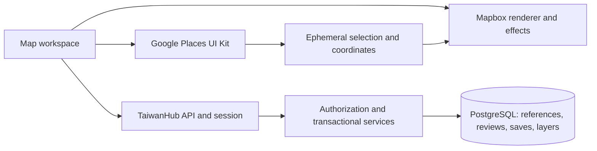

# Mapbox discovery and TaiwanHub reviews: engineering implementation plan

Status: P1 identity work implemented and tested locally (subjects, provider references, external saves, `layer_item.subject_id`, lookup/resolve/detail/save routes, selection grants, flags). Review tables and `submission.entity_revision` wait on D1; P0 and P2–P5 not started. Updated September 25, 2026.

This is the authoritative implementation handoff for the [Google integration design](google-places-integration-design.md). It incorporates the decision to retain Mapbox for map customization and cost. All new tables, endpoints, flags, and files below are proposed. Existing behavior is identified separately. This document does not authorize production migrations, deployment, cloud billing configuration, or paid API testing.

## 1. Decisions, scope, and remaining inputs

### Selected architecture

- Keep Mapbox GL JS, the existing map workspace, layer system, and list fallback.
- Use Google **Places UI Kit** for business autocomplete, submitted search, and business details. Do not substitute ordinary Places API calls on the Mapbox view.
- Store TaiwanHub comments, stars, saves, and layer membership in the existing PostgreSQL database. Do not post reviews to Google.
- Preserve Better Auth, invite-only membership, bilingual dictionaries, moderation, and server authorization.
- Keep current yes/no recommendations as a separate metric; do not convert them into stars or write local stars into `place.external_rating`.

### Product and operations decisions to record

| ID  | Decision                                                                             | Recommended working assumption                                                                                               | Owner / deadline                                               |
| --- | ------------------------------------------------------------------------------------ | ---------------------------------------------------------------------------------------------------------------------------- | -------------------------------------------------------------- |
| D1  | Does “only on my map” mean app-only community reviews or personally private reviews? | **Decided 2026-09-25: layer- or group-scoped reviews** (see “Scoped reviews” below). Supersedes the shared-review assumption | Product owner — recorded                                       |
| D2  | Initial geography                                                                    | Existing supported cities, Houston first; users can save an external reference before its city is reviewed                   | Product owner + backend lead, before collection implementation |
| D3  | Google account, applicable region terms, permitted component release channel         | Dedicated project; verify billing region and use supported Essentials components where available                             | Platform owner, during P0                                      |
| D4  | Monthly spend ceiling and pilot size                                                 | Use the model in section 10; owner supplies the actual budget and alert thresholds                                           | Product/platform owner, before any paid pilot                  |

Proceed with discovery adapters, map effects, fixtures, and API design while D1 is open. Do not enable shared review publication until D1 is settled. If private/group review visibility is selected, revise review uniqueness, membership authorization, aggregate partitions, moderation access, and sharing tests before implementing that branch. Private ratings must never enter a public aggregate.

### Scoped reviews (D1 decision, 2026-09-25)

The product owner chose layer- or group-scoped reviews, which replaces the shared-review assumption used elsewhere in this document. Where the plan says “public”, “approved public reviews” or “public aggregate”, read it as “within the review's scope”.

- Every review belongs to exactly one scope. A **layer** scope is visible to anyone who may view that layer. A **group** scope is visible only to that group's members.
- There is one editable review per member, place and scope: unique `(subject, user, layer)` or `(subject, user, group)`. A member may review the same place in several scopes.
- Aggregates (average stars, rated count, review count) are computed per scope and are never merged across scopes.
- Writing requires viewing the scope. A layer review also requires that place to be a member of the layer. A group review requires membership and an accessible subject (or a selection grant).
- Moderation: reviews in a **public-audience** layer start `pending` and count only after moderator approval. Reviews in private layers and in groups are visible to their audience immediately and can be reported. Publishing a layer returns its never-moderated approved reviews to `pending` in the same transaction.
- A moderator-rejected review returns to `pending` when edited, whatever its scope. Hidden and moderator-deleted rules are unchanged.
- An approved group-scoped review makes its subject visible to members of that group.
- Deleting a layer or group removes the reviews in that scope along with their history. Retention remains an open item (section 5).

### First release and later work

First release comprises P0–P4 below: discover a business, view it, comment/rate, save/reopen it, use eligible external places in layers, and retain a usable map/list during provider failures. P5 is controlled rollout. Partial milestones must not be advertised as the complete integration.

Defer review photos/replies/helpfulness votes, automatic translation of reviews, routing APIs, stored Google business catalogs, background refresh crawlers, automated identity merging, full-map Google POI click behavior, and advanced 3D effects. Selection effects and extensible Mapbox rendering are in scope. Clicking existing Mapbox basemap labels will not automatically resolve a Google business.

## 2. User experience and acceptance contract

1. Show **TaiwanHub layers** and **Find a business** as distinct discovery modes. Keep the current `scope=layers|city` semantics for catalog queries; business search uses separate state.
2. Lazy-load Google only when opening business discovery or reopening an external business. Search supports a business name and submitted category queries such as “Taiwanese restaurant.” Bias toward the selected city/viewport. An explicit **Search this area** action triggers a new area request; panning alone does not.
3. Selecting a result creates a temporary search pin and opens the existing responsive detail surface. Keep Google's attributed details in its component; render TaiwanHub actions and reviews in a distinct region. No durable record is created by browsing.
4. Signed-in members can save, add a comment, or assign 1–5 stars. Support a comment without stars, stars without a comment, or both. One editable review per member/business; no empty review. The button says **Publish on TaiwanHub**, with audience and moderation state visible. Anonymous users get the existing sign-in entry, not a new public signup flow.
5. Only approved, nondeleted reviews count publicly. Show average stars to one decimal and the number of rated reviews. Comment-only reviews count toward a separately named review count. No ratings displays **No TaiwanHub ratings yet**, never `0 stars`.
6. Existing catalog places use their existing links and saves. A new external place can be saved immediately; adding it to a city layer requires a reviewed city association. Show **Saved — city review needed before adding to a layer** when necessary.
7. Saving or commenting does not publish the business into Discover. Private/group membership and notes remain private/group. Google failures preserve local contributions and draft text and offer a retry.
8. Selected pins receive a visible outline/halo, nonselected pins remain legible, layer visibility transitions smoothly, and camera positioning accounts for the detail panel. Respect reduced motion and keyboard selection; effects must not remount the map or cause provider requests.

New copy belongs in the English/Traditional Chinese dictionary. Test Chinese IME composition, short Chinese queries, focus return after closing the panel, keyboard-accessible stars with text labels, mobile sheet scrolling, and status announcements. Never place user review text into raw HTML or require color alone to identify state.

## 3. Verified repository integration points

Verified against source on September 25, 2026; recheck before coding.

| Existing file / area                                                                 | Required work                                                                                                                                                      |
| ------------------------------------------------------------------------------------ | ------------------------------------------------------------------------------------------------------------------------------------------------------------------ |
| `apps/web/src/components/map/map-workspace.tsx`                                      | Discovery mode, temporary selection, authorized external-reference loading, stale-response suppression; preserve current URL/history and request sequence handling |
| `apps/web/src/components/map/map-canvas.tsx`                                         | Separate discovery/external sources, selection effects, stable map instance, cleanup and style reload handling                                                     |
| `apps/web/src/components/map/map-toolbar.tsx`, `map-results.tsx`, `item-preview.tsx` | Search mode, attributed provider region, review editor, distinct pending/unresolved states                                                                         |
| `apps/web/src/components/map-view.tsx`                                               | Preserve catalog map fallback; provider integration is not a reason to duplicate a second search implementation                                                    |
| `apps/web/src/features/map/query.ts`, `request.ts`, `detail.ts`                      | Additive external-reference projection and authorization; do not present unresolved provider geometry as server-known geography                                    |
| `apps/web/src/features/layers/{service,repository,contents}.ts`                      | Subject membership, city validation, canonical deduplication, library/detail counts, and safe removal                                                              |
| `apps/web/src/features/catalog/repository.ts`                                        | Existing catalog saves/details and recommendation metrics remain valid; canonical saved-state lookup                                                               |
| `apps/web/src/features/community/service.ts`                                         | Extend reports/moderation routing; delegate review-specific transactional rules to the new service                                                                 |
| `apps/web/src/app/api/v1/[...path]/route.ts`                                         | Register proposed local routes using current response envelopes, Origin checks, session actors, and limits                                                         |
| `packages/shared/src/index.ts`                                                       | Zod contracts, review rules, new reference key, explicit mapping of keys to entities; preserve existing visual item types                                          |
| `packages/database/src/schema.ts` and migrations                                     | Add subjects, references, reviews/history/saves; extend layer constraint and review submission metadata                                                            |
| `apps/web/src/lib/config.ts`, dictionary, analytics allowlists                       | New server-read flags, copy, redacted operational counters                                                                                                         |

New modules: `apps/web/src/features/place-subjects/{service,repository,router}.ts`, `apps/web/src/features/reviews/{service,repository}.ts`, and `apps/web/src/components/places/{google-discovery,google-details,review-editor,review-list}.tsx`. A small client adapter under `apps/web/src/lib/places/` owns Google loading/events and a deterministic test implementation. These paths are proposals, not existing modules. Follow the membership router delegation pattern rather than growing business logic in the catch-all route.

Before changing framework code, read `apps/web/AGENTS.md` and the relevant installed Next.js docs under `apps/web/node_modules/next/dist/docs/`. Verify Google element types against the selected release channel; do not invent methods or add a second client-state framework.

## 4. Architecture and provider boundary



Google provides the live business identity/display; TaiwanHub provides community content. The browser sends only a provider ID or existing catalog ID when resolving a local subject. No endpoint accepts a Google details payload to populate a permanent `place` row. Provider IDs and client callbacks are untrusted input, not proof of existence, city, ownership, or verification. An unverified reference may be privately saved; publication requires moderation.

Use supported UI Kit search/detail events and properties for temporary pins. Keep the provider component visible with attribution. Ordinary `Place.fetchFields`, Places REST search/details, and ordinary Places autocomplete must not be quietly added as fallbacks on this Mapbox surface. Resolve component/channel capability gaps in P0 rather than bypassing the boundary.

The non-EEA [Google service terms, sections 14–15](https://cloud.google.com/maps-platform/terms/maps-service-terms) distinguish standard Places API map restrictions from the UI Kit exception for non-Google maps. Confirm applicable terms for the actual billing region. The [UI Kit overview](https://developers.google.com/maps/documentation/javascript/places-ui-kit/overview) identifies components and preview features. These are implementation constraints, not a claim that every planned combination has been live-tested.

## 5. Database and identity contracts

All IDs are UUIDs unless stated otherwise. Use database constraints plus service validation, not TypeScript types alone. New statuses/enums must have explicit SQL checks. Preserve existing catalog records and migrations.

| Proposed table/change        | Fields and invariants                                                                                                                                                                                                                                                                                                                                       |
| ---------------------------- | ----------------------------------------------------------------------------------------------------------------------------------------------------------------------------------------------------------------------------------------------------------------------------------------------------------------------------------------------------------- |
| `place_subject`              | `id`, nullable unique `catalog_place_id`, nullable `city_id`, `city_review_status` (`unreviewed`, `approved`), `status` (`active`, `hidden`, `deleted`), `revision`, timestamps. City approval metadata includes reviewer/time; linked approved catalog places inherit city from that catalog place. Status `active` alone does not grant public visibility |
| `place_provider_reference`   | `id`, `subject_id`, `provider='google'`, `provider_place_id`, `state` (`current`, `superseded`), timestamps. Unique `(provider, provider_place_id)` across all states; partial unique current provider per subject. No provider name/address/photo payload                                                                                                  |
| `place_review`               | `id`, `subject_id`, `user_id`, nullable integer `stars` (1–5), `body` (trimmed plain text, at most 2,000 characters), `status` (`pending`, `approved`, `rejected`, `hidden`, `deleted`), nullable `deletion_source` (`author`, `moderator`), `revision >= 1`, timestamps. Unique `(subject_id,user_id)`; stars present OR nonempty body                     |
| `place_review_revision`      | Append-only snapshot of each content/status revision with review ID, revision, actor ID, change kind, stars/body/status, timestamp. Unique `(review_id,revision)`; private to author where appropriate and moderators; public reads never expose history                                                                                                    |
| `saved_place_subject`        | `(user_id,subject_id)` primary key and creation time; used for external subjects. Existing `saved_place` remains the canonical store for catalog saves                                                                                                                                                                                                      |
| `layer_item.subject_id`      | Nullable subject FK; extend exactly-one-target check to place/event/content/subject; partial unique `(layer_id,subject_id)`                                                                                                                                                                                                                                 |
| `submission.entity_revision` | Nullable integer for backward compatibility; required by the review service for new review submissions. Decisions must target the current pending revision, not every submission for the review ID                                                                                                                                                          |

Use restrictive FKs/soft deletion for subject and review identity so ordinary deletion does not erase history. The existing database documentation identifies retention/erasure as unfinished: define how these new history tables participate before production launch; do not imply soft deletion removes retained text from backups/history. Add subject/status/date indexes for review pagination, author lookup, subject FK indexes, and saved/layer reverse lookup indexes. Average stars can initially be computed from approved rows, avoiding a second stored counter to maintain.

### Resolution and canonicalization

- Resolve existing catalog IDs only if accessible and approved; demo places never acquire real Google references. Create their subject lazily. Concurrent subject creation must resolve through the unique catalog FK.
- Resolve Google IDs with bounded string validation (maximum 512 characters), database uniqueness, and a transaction. A unique-constraint race must roll back any newly created loser subject and return the winner. Never use name matching to merge branches.
- Linking a Google reference to a catalog place is a moderator/admin operation with reason and revision checks. Reject links to hidden/deleted/demo catalog places. For an external subject with no competing catalog subject, link it, inherit its city, and transactionally canonicalize saves/layer references.
- If both identities already have separate subjects, return `409 SUBJECT_MERGE_REQUIRED`; merging conflicting member reviews is a later audited operation, not an automatic last-write-wins update. Show the issue in the operator queue and do not silently lose contributions.
- Retain superseded provider IDs as aliases to the same subject. Only an audited operator action may replace a current provider ID; a client cannot move a review to another business.
- Known blocked subjects/catalog links stay blocked when accessed through another stored alias. Unknown duplicates cannot be magically detected; moderation handles them without claims of automatic verification.

### Transaction requirements

Lock the subject first, then affected review/saves/layer rows in deterministic order. Review content/state, immutable revision snapshot, pending submission changes, and allowlisted analytics commit together. Canonical linking holds the subject lock while reconciling legacy/external save rows and duplicate layer memberships. Preserve existing layer notes and positions; any conflicting notes require operator resolution rather than silent overwrite.

## 6. Authorization, moderation, and API contracts

This section assumes D1 selects shared TaiwanHub reviews. All writes require the existing session actor and Origin protection. Apply the existing PostgreSQL contribution limit and a separate bounded lookup/read limit; never accept a body user ID, role, moderation state, or city approval. Use the existing `{data: ...}` / `{error:{code,message}}` envelope.

Subject visibility is a predicate: active subject AND an approved linked catalog record, an approved public review, an authorized layer membership, an own save/review, or moderator access. A hidden/deleted linked catalog record overrides visibility and prevents publication through the subject. Public provider lookup returns only public local state; unknown and unauthorized references return the same empty match. It must not reveal who saved a place, private layer counts, or an unreviewed reference's existence.

To bridge first selection to first write, `resolve` also returns a server-signed, actor-bound `selectionGrant` expiring after 10 minutes. It permits only an own review/save for that active subject, never another user's content, city approval, or layer access. Sign with a server-only key and a distinct purpose; recheck actor, expiry, subject status, and canonical link on use. This grant proves only that the member completed local resolution, not Google authenticity. Keep it in memory and POST/PUT bodies, never URLs or logs. A new member selecting an already-private-saved business receives the same limited grant without learning anything about the other saver. Public/otherwise accessible subjects do not require it. Re-resolve on expiry while retaining draft text.

| Proposed route                                                          | Contract                                                                                                                                                                                                                                                                                        |
| ----------------------------------------------------------------------- | ----------------------------------------------------------------------------------------------------------------------------------------------------------------------------------------------------------------------------------------------------------------------------------------------- |
| `GET /api/v1/place-subjects/lookup?provider=google&providerPlaceId=...` | Read-only, bounded; `{subjectId:null}` for no public/authorized match, otherwise accessible ID and public review summary. No insert or Google call                                                                                                                                              |
| `POST /api/v1/place-subjects/resolve`                                   | Strict union `{catalogPlaceId}` OR `{provider:'google',providerPlaceId}`. Idempotently resolves identity and returns `{subjectId,canonicalKey,cityReviewStatus,selectionGrant}`. Only call as part of an explicit save/review/add intent; rate-limit creation; resolving alone does not publish |
| `GET /api/v1/place-subjects/{uuid}`                                     | Authorized local metadata, review summary, own action state, provider ID; no stored provider display payload. No session-dependent response in shared caches                                                                                                                                    |
| `GET /api/v1/place-subjects/{uuid}/reviews?page=1`                      | 20 approved reviews per page, newest first with UUID tie-break; `{items,totalReviews,ratedCount,averageStars,ownReview}`. `ownReview` is separate from public results; no other pending text                                                                                                    |
| `PUT /api/v1/place-subjects/{uuid}/review`                              | `{stars:1..5\|null,body:string,expectedRevision:number\|null,selectionGrant?:string}`. Null revision creates; existing content requires the current revision. Returns current review and pending/hidden state; conflict is 409                                                                  |
| `DELETE /api/v1/place-subjects/{uuid}/review`                           | `{expectedRevision}`. Owner soft-deletes. Repeated deletion of an already author-deleted record succeeds without another submission/history entry                                                                                                                                               |
| `POST / DELETE /api/v1/place-subjects/{uuid}/save`                      | Idempotent; POST optionally accepts `{selectionGrant}` for first save. Resolve linked catalog subjects into existing `saved_place`, otherwise external join. Unsave is permitted for one's unavailable saved reference without exposing hidden content                                          |
| `GET /api/v1/map/external-references`                                   | Same authorized layer selection/date/type context, or own saves; cursor page of up to 12 references, described in section 7                                                                                                                                                                     |
| Existing layer item routes                                              | Add/remove `subject:uuid` after current ownership/group checks and reviewed city match; preserve existing keys and response semantics                                                                                                                                                           |
| `PATCH /api/v1/admin/place-subjects/{uuid}`                             | Moderator/admin, `{expectedRevision,reason,cityId?}` or a strict catalog/provider-link operation. Validate allowed transitions; city is a reviewed TaiwanHub association, not claimed Google verification                                                                                       |
| Existing report/admin decision routes                                   | Add review/subject entities explicitly. Review decisions require `expectedRevision`; use specialized service dispatch. ADMIN still required for moderator-driven deletion                                                                                                                       |

Add `GET /api/v1/admin/place-subjects?cityReviewStatus=unreviewed&page=1` for moderators/admins. It lists subjects with an actual save/review/layer reference awaiting city curation, 20 per page; unused resolution records do not flood the queue. Show live attributed business details for review and record the PATCH decision/reason in audit history. Subjects outside supported cities remain saveable but cannot join city layers. Extend the admin review queue with local review snapshots; do not require generic catalog `name`/`image` fields on review records.

New errors: `REVISION_CONFLICT`, `SUBJECT_MERGE_REQUIRED`, `CITY_REVIEW_REQUIRED`; reuse `CITY_MISMATCH`, `NOT_FOUND`, `FORBIDDEN`, `RATE_LIMITED`, and `DISABLED`. Preserve all existing `/v1` behaviors. Resolve strict routes before the generic catalog catch-all. Never interpolate a new key kind into SQL table/column names; use an explicit allowlisted mapping.

Review state rules:

- Create → pending. Owner edit of pending/approved/rejected → pending and increment revision. Approved content is removed from public results until reapproved; explain that in the editor.
- Owner edit of hidden content remains hidden. Owner re-submission of an author-deleted review → pending; moderator-deleted reviews cannot be revived by an owner. Preserve deletion provenance until the transition is recorded.
- Approval/rejection/hide/delete requires the expected current revision. A moderator approving an old snapshot after an owner edit receives 409. Mark only the relevant pending submission resolved; supersede earlier review revisions without overwriting unrelated report history.
- Every content/state change increments revision and creates an immutable snapshot. A retried stale PUT returns 409; the client reloads and recognizes its already-applied content rather than resubmitting duplicate notes.
- Public stars use `AVG(stars)` and `COUNT(stars)` over visible approved reviews only. Hiding/deleting a subject makes all its aggregates unavailable. Private/group layer notes never enter these queries. Leave the existing yes/no ranking unchanged in this release.

## 7. Saved places, layers, and map/list consistency

### Separate business type from reference identity

Keep visible item types `place|event|content`; an external subject is still a place. Introduce a separate reference kind for `subject:uuid` so `types=place` includes both catalog and external places. Update parsing, Zod validation, `itemHref`, selection, contains checks, add/remove mapping, reports, and detail unions explicitly. Existing `place:uuid` links remain valid. A subject detail link uses `/place-subjects/{uuid}` and resolves through authorization; linked catalog subjects point to the existing canonical place page. Do not generate a business-name slug from Google data.

Temporary discovery selections use an in-memory discriminated selection and do not enter the durable layer membership table or current catalog `item` URL until a subject exists. Closing discovery restores the previous catalog selection; Back/Forward for saved subject keys must work. Reloading a purely temporary selection may return to discovery without storing its details.

### External-reference projection

The current map service assumes server-owned names and coordinates; its `mapPageSize` is 20 and `maxMapPoints` is 1,000. Do not force external records into that projection with invented placeholders or persistent Google coordinates.

Add a parallel response with authorized references only:

```text
{ references: [{ subjectId, canonicalKey, providerPlaceId, localNote,
                cityReviewStatus, localReviewSummary }],
  nextCursor, totalAuthorizedReferences, pageSize: 12,
  spatialFilter: 'pending-provider-resolution' }
```

Order deterministically by layer position/UUID or saved time/UUID. Deduplicate subjects across applied layers and canonical catalog links before pagination. Fetch/render at most 12 external rows at once; prototype supported visible UI Kit details resolution with concurrency at most 3. Do not mount hidden components to harvest bulk data. If the supported API cannot provide this bounded visible experience, revise P4 before release, rather than silently use a standard Places details API.

The client maintains one shared resolved view model for external rows and pins. A row is `loading`, `resolved`, or `unavailable`; validate finite coordinates and ranges before plotting. Known resolved points outside the selected area are excluded from the in-area list and pins together. Unresolved items remain in a separately labeled list section, never as `(0,0)` markers. Show explicit counts such as **8 catalog matches · 3 external businesses in this page · 2 awaiting location**. Never present `totalAuthorizedReferences` as a spatial match count or claim all external businesses are mapped when only one page is loaded. Selection outside the page loads one authorized detail separately.

Reserve space within the existing 1,000-point canvas budget for the currently rendered external/search page and selected point. Keep any excess catalog results in the list with an explicit map truncation indicator. Changing that budget requires measured performance evidence; additional sources are not permission to bypass it.

The server must not search, sort, or spatially filter external records using Google fields it does not store. Label the limitation: local layer text filtering covers TaiwanHub-authored data; business-name discovery uses Google. External references have no canonical business category until independently curated, so do not pretend they match a specific restaurant/grocery subtype. Place-level filters and layer dates remain valid. A future global external spatial index requires a separate data-lifecycle design.

### City and access rules

An external subject's city is null until a moderator assigns it as local curation metadata. Client-provided bias/coordinates cannot approve its city. Saves and pending reviews work before approval; adding to a city layer does not. Linked catalog places inherit their server-owned city. Layer subject writes require matching approved city and an active subject, including private/group layers. Public layer reads additionally require approved publication and reviewed subject city; private notes stay scoped to the authorized membership. Changes to approved public layer membership that introduce external subjects must return that layer to pending publication in the same transaction, preventing a reviewed layer from publishing unchecked new references. Group-owned layers remain group-only as in the current release.

My saves stays an owner-only projection. Read APIs authorize layers before resolving provider IDs. Changing group membership or layer audience must remove unauthorized references on refresh and prevent fresh detail reads. Provider content already shown in a browser cannot be retroactively erased; no private notes or drafts go to Google.

## 8. Map customization and client lifecycle

Preserve one Mapbox instance per workspace mount. Keep catalog, temporary search, and authorized external references in separate sources so clearing a search cannot delete layer pins. Use stable source/layer IDs, explicit visual ordering, and shared selected identity; reapply app sources after a style reload. Remove listeners, animations, and provider elements on unmount, including development remounts.

P3 effects use runtime theme tokens and existing glyph conventions. Use layer paint/state updates for halo, opacity, and visibility transitions; avoid replacing the map style for a selection change. Reduced-motion mode disables animated travel and continuous pulsing. Inactive background tabs stop continuous effects. Keep any later 3D/data visualization adapter independent of Google discovery and review services.

Preserve request sequence guards on both provider and TaiwanHub requests. A late result for an old query or old selected business cannot replace the current panel. Do not store drafts, provider payloads, or exact coordinates in localStorage/analytics. Keep review draft text in component memory through recoverable errors; warn before an intentional navigation discards it. Log no raw provider response bodies.

## 9. Data lifecycle, keys, flags, and failure behavior

MVP stores provider IDs and TaiwanHub-authored data only. Live Google names, addresses, photos, hours, ratings, and coordinates remain transient presentation data; no database, server/CDN cache, static metadata, search index, or service-worker payload cache. Reopen a saved reference using the visible supported component. Do not populate required `place` fields by copying a Google response. Keep provider errors redacted.

Google allows retained place IDs and has restrictions on other content; preserve attribution and the required terms/privacy disclosures. See [Places policies](https://developers.google.com/maps/documentation/places/web-service/policies). If persistent coordinate caching is later introduced, review the specific permission, provenance, expiry, purge, geometry/index copies, and backup retention first; it is outside this first release.

Proposed configuration (document placeholders in `.env.example` during implementation):

| Variable                               | Default / purpose                                                                                 |
| -------------------------------------- | ------------------------------------------------------------------------------------------------- |
| `NEXT_PUBLIC_GOOGLE_PLACES_UI_KIT_KEY` | Empty; intentionally browser-visible restricted key, never a privileged server key                |
| `FEATURE_GOOGLE_PLACES_DISCOVERY`      | `false`; controls provider-backed discovery and hydration                                         |
| `FEATURE_PLACE_REVIEW_WRITES`          | `false`; controls new review writes, preserving authorized existing reads                         |
| `FEATURE_EXTERNAL_PLACE_COLLECTIONS`   | `false`; controls new external saves/layer writes; existing reference reads/removal remain usable |
| `FEATURE_MAP_EFFECTS`                  | `false` during pilot; presentation-only rollback                                                  |

Read flags server-side through existing config and pass only necessary public booleans to clients. Enforce write flags inside services too. Existing submission/layer-write switches must continue to disable their relevant mutations. Existing Google OAuth credentials are unrelated to Places; do not repurpose them. Restrict the browser key by allowed referrers and required APIs, with separate environments. Apply [Google's key guidance](https://developers.google.com/maps/api-security-best-practices).

Discovery disabled or provider unavailable: existing catalog map/list and local reviews work; saved external entries show an unavailable-detail state and can be removed. Mapbox unavailable: provider details and authorized local content remain usable in list mode. Auth expiry: preserve draft in memory and ask for sign-in. Closed/moved/not-found businesses: show provider state if available; retain authored content and do not auto-delete or auto-reassign it.

Google browser calls do not pass through local API rate limits. Provider quotas/key restrictions are necessary for spend control; an application flag cannot stop calls from an already-open tab immediately. Environment flag changes may require deployment/reload. Document the platform's quota/disable procedure; billing alerts alone are not spending caps. Do not add a server proxy that changes the product/terms merely to simulate a hard cap.

## 10. Cost model and instrumentation

Reference prices checked September 25, 2026; use actual account pricing and recheck before launch. USD pay-as-you-go, excluding hosting/tax, assuming unused allowances. [Mapbox pricing](https://www.mapbox.com/pricing) and [Google pricing](https://developers.google.com/maps/billing-and-pricing/pricing).

| Meter                                 | Monthly free allowance | First paid band per 1,000                       |
| ------------------------------------- | ---------------------- | ----------------------------------------------- |
| Mapbox GL JS loads                    | 50,000                 | $5 through 100,000 loads                        |
| UI Kit standard search/detail queries | 10,000 combined        | $1 through 100,000 queries                      |
| UI Kit Basic Autocomplete sessions    | 10,000                 | $10 through 100,000 sessions                    |
| UI Kit Pro                            | 5,000                  | $5 through 100,000 requests; not assumed in MVP |

For each meter within the first paid band, cost is `max(0, usage - allowance) / 1000 * rate`. A submitted search plus one details load is two standard queries. Autocomplete sessions are a separate meter; they are not interchangeable with submitted searches. Saved-place reopening also consumes details queries. See [Google SKU definitions](https://developers.google.com/maps/billing-and-pricing/sku-details) and [Basic Autocomplete billing](https://developers.google.com/maps/documentation/javascript/places-ui-kit/basic-autocomplete).

Example: 50,000 map loads plus 10,000 submitted searches and 10,000 details loads estimates $10/month. At 100,000 loads, 20,000 searches and 20,000 details loads estimate $280/month. Adding 20,000 UI Kit autocomplete sessions to that second workload adds $100; additional saved-place opens are not included. These are workload examples, not an approved budget or a user-count forecast.

Count map initializations, component requests by type, load failures, review submission/approval outcomes, and unresolved reference counts. Use aggregate operational metrics; do not log search text, provider payloads, review bodies, emails, or exact locations. Client counters are estimates, not authoritative billing. Platform owner reconciles them with Google/Mapbox billing reports during the pilot and sets thresholds from D4. Reuse the current map, request details only when needed, and do not retry paid requests automatically without a strict limit.

## 11. Sequenced work packages and ownership

| Phase                            | Owner                         | Deliverables                                                                                                                                                      | Dependency / exit criteria                                                                                                                                                       |
| -------------------------------- | ----------------------------- | ----------------------------------------------------------------------------------------------------------------------------------------------------------------- | -------------------------------------------------------------------------------------------------------------------------------------------------------------------------------- |
| P0 — feasibility and decisions   | Frontend + platform + product | Mock adapter, supported component/channel matrix, Google/Mapbox attribution layout, selected/reopened IDs, sample cost measurements when authorized; record D1–D4 | Demonstrate autocomplete → details → Mapbox pin, bilingual input, list-only mode, and bounded reopening. Record any preview dependency; no workaround using standard Places APIs |
| P1 — identity and schema         | Backend                       | Shared schemas, subjects/references/review history/saves migration, resolve/lookup, authorization predicates, deterministic fixtures                              | D1 resolved before review persistence contract; unique races and catalog-link behavior pass on disposable DB; migration SQL/snapshot/journal reviewed                            |
| P2 — reviews and operations      | Backend + frontend            | Review routes/editor/list, revision-safe moderation and reports, city review queue, catalog linking conflicts                                                     | Approval/edit/delete transitions and aggregates pass; own pending visibility and unauthorized reads tested; no public publishing without D1                                      |
| P3 — discovery and effects       | Frontend                      | UI Kit adapters, discovery mode, temporary selection, own review panel, stable Mapbox sources, reduced-motion effects                                             | P0 and local API contracts; keyboard/mobile/provider failure tests; ordinary layer browsing makes zero Google calls                                                              |
| P4 — collections and consistency | Backend + frontend            | External saves, subject detail page, layer references, reviewed city rule, paginated visible hydration, explicit counts, canonical save/link handling             | P1–P3; reload/reopen and group revocation tested; unresolved/out-of-area behavior consistent; no unauthorized IDs leaked                                                         |
| P5 — release                     | QA + platform + product       | Full verification evidence, authorized staging/pilot, spend dashboard, feature-flag rollout, operator runbook, current API/database docs                          | D1–D4 recorded, all release criteria pass, explicit production migration/deployment authorization                                                                                |

Suggested PR boundaries follow P1 identity/schema, P2 reviews/moderation, P3 discovery/effects, P4 collections, then P5 docs/rollout. Keep flags off until dependent routes and UI are deployed together. Do not include dependency upgrades or unrelated refactors. This is an ordered backlog; duration estimates belong to the implementing team after P0.

## 12. Verification matrix and commands

| Level                     | Required coverage                                                                                                                                                                                                                                                                                                                                                                                               |
| ------------------------- | --------------------------------------------------------------------------------------------------------------------------------------------------------------------------------------------------------------------------------------------------------------------------------------------------------------------------------------------------------------------------------------------------------------- |
| Unit                      | Strict resolve union, malformed/oversized provider IDs, stars 0/6/fractions rejected, comment-only valid/empty invalid, subject key mapping, rating null/count rules, revision transitions, stale selection, bounded pagination, finite coordinates, reduced-motion behavior                                                                                                                                    |
| Database integration      | Concurrent resolve creates one subject/reference with no orphan loser; review uniqueness; ownership; old moderator revision rejected; atomic history/submission/analytics; approval/edit/hide/delete aggregates; catalog-link save reconciliation; no auto-merge of conflicts; author vs moderator deletion                                                                                                     |
| Authorization integration | Guessing private subject/layer IDs; lookup does not reveal private existence; expired/forged/wrong-actor selection grants rejected; second member can legitimately select/save a previously private-saved business without seeing private data; city unreviewed/mismatch; moderator roles; group revocation; My saves isolation; hidden catalog aliases blocked; public-layer membership change reenters review |
| Browser, mocked providers | Search/select/review/save/reload, traditional Chinese IME, mobile and keyboard, Back/Forward, sign-in interruption, no Google calls on ordinary browsing, no extra map initialization on effects, provider outage, map outage, stale result, bounded reference page, no `(0,0)` fallback, untrusted provider text                                                                                               |
| Authorized live staging   | Actual UI Kit channel/types, attribution, selected-place marker, supported visible saved-place hydration, referrer restrictions, applicable SKUs, real mobile performance and quota failure                                                                                                                                                                                                                     |

Extend existing `tests/unit/domain.test.ts`, `layers.test.ts`, `tests/integration/community.test.ts`, `map.test.ts`, `groups.test.ts`, and `tests/e2e/map.spec.ts` where appropriate. Add focused `place-subjects`, `reviews`, and `places-discovery` suites. Fake providers return synthetic data and never require a live key in CI. Record that mocked tests cannot establish real provider compatibility or billing accuracy.

Before integration/E2E/migrations, verify the effective `DATABASE_URL` targets the intended disposable development/test database without printing credentials. Use Node 22 and pinned pnpm 10.15.0. Commands are from workspace root:

```sh
pnpm db:generate
# Review new SQL, snapshot, and journal; apply only to the checked disposable DB.
pnpm db:migrate
pnpm db:seed
pnpm lint
pnpm typecheck
pnpm test
pnpm test:integration
pnpm exec playwright install chromium
pnpm test:e2e
pnpm build
```

Run relevant focused checks during each PR; the release must pass the full suite used in `.github/workflows/ci.yml`. Seeds never run against production. Reused E2E servers must use the checked test DB; do not run development and production on the same port. Review the final diff for generated/unrelated files and secrets. Leave `docs/dev-notes.md` unchanged unless the human explicitly authorizes edits.

## 13. Release, rollback, and completion checklist

1. Complete P0 evidence and record D1–D4. Confirm Google project/API restrictions, public terms/privacy disclosures, and spend monitoring with the platform owner.
2. Generate and test additive migrations on a disposable DB. Keep legacy schema/routes usable. Update `docs/api.md`, `docs/database.md`, `docs/architecture.md`, `docs/deployment.md`, and `.env.example` in the implementing PRs; these remain descriptions of shipped behavior until then.
3. Deploy to authorized staging with all new flags off. Test old catalog/layer routes before enabling new paths. Enable discovery, then reviews, then collections for the agreed pilot; record rollout control mechanism and operator.
4. Run an authorized pilot; compare provider billing with assumptions, exercise outage/quota behavior, and inspect mobile responsiveness. Release to the agreed audience only after verification and publication decisions are resolved.
5. Roll back new entry points/writes with flags. Preserve new reviews/reference data and existing authorized reads/removal. If provider calls must stop urgently, use the documented Google API/key/quota controls as well. Roll back effects independently. Prefer forward fixes; never drop new tables or rewrite applied migration history as an automatic rollback.

Release is complete only when users can discover, review, save, and reopen businesses; eligible external places work in layers; public/private boundaries and moderation are proven; stale/failed locations do not create misleading pins/counts; both languages and list fallback work; paid usage is measured; and operators have an executable rollback/runbook. Handoff evidence includes PR links, migration review, actual test results, prototype limitations, applicable account settings without keys, the approved budget, and remaining defects with owners.
