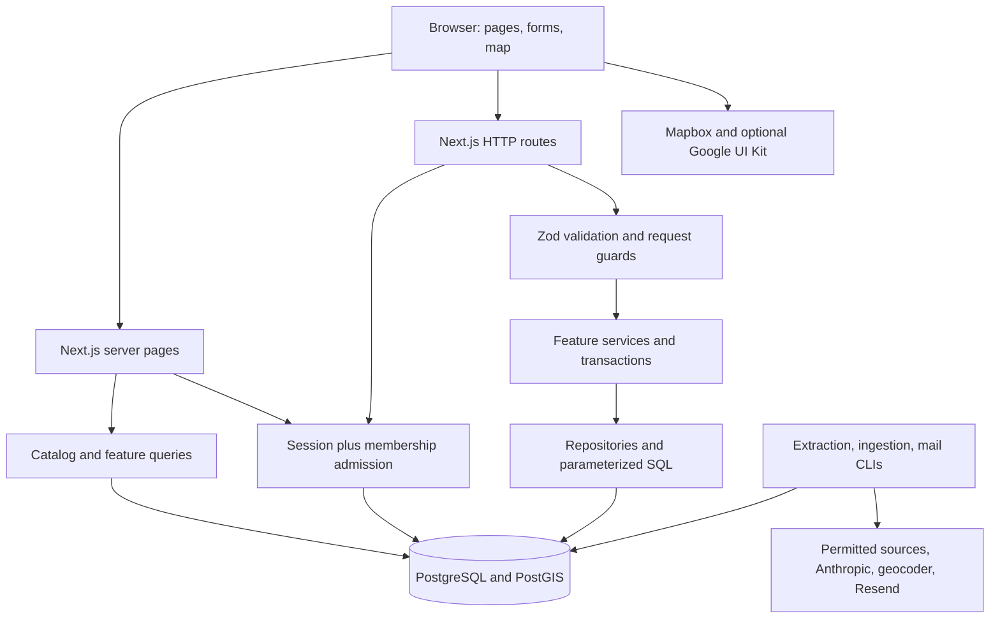
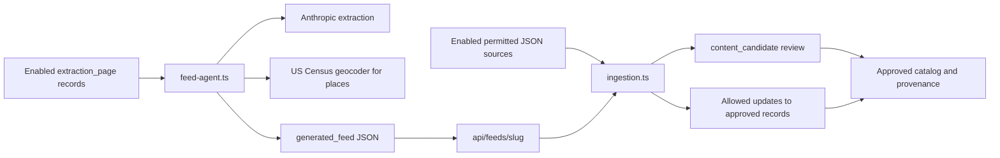

# TaiwanHub engineering onboarding: implemented stack and architecture

Reviewed against repository commit `4d8ee68` on September 26, 2026. This is a source-based map of the implementation, not an assertion that optional services or deployments are enabled. Dependency versions below are repository declarations, not recommendations to upgrade. Use the lockfile for exact resolved versions.

TaiwanHub is a Houston-first, English/Traditional Chinese discovery application. Its primary experience combines a map, applied collections called layers, and a usable list fallback. Supporting domains include catalog content, community participation, collaborative groups, invitation-only membership, scoped place reviews, and moderated ingestion. Read the [user guide](user-guide.md) alongside this document to understand the workflows behind the code.

## Contents

- [First-day setup](#first-day-setup)
- [Technology stack](#technology-stack)
- [Repository and request architecture](#repository-and-request-architecture)
- [Domain and persistence map](#domain-and-persistence-map)
- [Core flows and invariants](#core-flows-and-invariants)
- [Configuration and external boundaries](#configuration-and-external-boundaries)
- [Background work and delivery](#background-work-and-delivery)
- [Testing and change workflow](#testing-and-change-workflow)
- [Practical onboarding exercises](#practical-onboarding-exercises)
- [Implemented limits and follow-up reading](#implemented-limits-and-follow-up-reading)

## First-day setup

Read [AGENTS.md](../AGENTS.md) and, before web changes, [apps/web/AGENTS.md](../apps/web/AGENTS.md). The nested guide requires consulting the relevant installed Next.js documentation under `apps/web/node_modules/next/dist/docs/` before writing Next.js code. `docs/dev-notes.md` is reserved for human edits.

Prerequisites: Node.js 22, pnpm **10.15.0** (the `packageManager` pin), Docker Desktop with Linux containers, and an available local PostgreSQL port 5432. Run from the repository root.

```powershell
git status --short
node --version
pnpm --version
pnpm install --frozen-lockfile
if (-not (Test-Path .env)) { Copy-Item .env.example .env }
```

Edit your local `.env`: set a random `AUTH_SECRET` of at least 32 characters and keep both app/auth origins consistent with `http://localhost:3000`. Do not overwrite an existing environment file or print its credentials into logs. Next loads the root `.env` through its config; CLI database tools use `dotenv/config`. Existing process environment values may override file settings.

**Before database writes or database/browser tests, verify the effective `DATABASE_URL` points to your intended disposable local/test database.** The commands do not create an isolated test database automatically. Docker Compose supplies PostgreSQL/PostGIS, binds it to loopback, and persists it in a named volume.

```powershell
docker compose up -d
pnpm db:migrate
pnpm db:seed
pnpm dev
```

Open `http://localhost:3000`. Guest browsing works without Mapbox, Google OAuth, S3, or an LLM key. Use the list fallback when no map token exists. `db:seed` creates labeled demo content and users with no credential accounts; it installs no usable default login. It does not reset existing event dates on every run. `db:seed:reference` is the narrower command for Houston, categories, and system layers when demo content is not wanted.

### Obtain a development member/admin account

1. Set `MEMBERSHIP_MODE=invite_only`; the default is `closed`.
2. Configure a usable development mail transport before manually testing OTP. With `MAIL_PROVIDER` unset outside production, the in-memory test transport does **not** display or deliver messages to your inbox. Automated suites supply their own test/capture setup. For manual delivered-email testing, use the configured Resend transport and an authorized sender/account.
3. In a fresh database with no admin or active bootstrap invitation, run:

   ```powershell
   pnpm membership:bootstrap you@example.com
   ```

4. Open the one-time `/join#invite=...` link, accept the notice, and complete the email OTP flow.
5. After admission succeeds, run:

   ```powershell
   pnpm admin:grant you@example.com
   ```

6. Re-enter the application and verify `/admin`. In `/admin/membership`, close the used bootstrap batch before opening a normal batch; only one batch may be open.

If an admin already exists, use its direct-invite workflow. Granting a role alone is not membership admission. Production invitations, role grants, migrations, mail sends, and live data changes require authorization for that environment; development setup commands are not a production runbook.

## Technology stack

Source of truth: [root package.json](../package.json), [web package.json](../apps/web/package.json), [pnpm lockfile](../pnpm-lock.yaml), and [CI workflow](../.github/workflows/ci.yml).

| Area                        | Implemented choice / declared version                        | Use                                                                                                                                |
| --------------------------- | ------------------------------------------------------------ | ---------------------------------------------------------------------------------------------------------------------------------- |
| Runtime/workspace           | Node 22; pnpm 10.15.0 workspace                              | One web app and two source-exported packages; root scripts orchestrate work.                                                       |
| Web framework               | Next.js 16.3.5, App Router                                   | Server-rendered pages, route handlers, metadata, sitemap, error/loading boundaries.                                                |
| UI                          | React/React DOM `^19.2.0`, TypeScript `^5.9.3`               | Strict TypeScript; server components plus interactive client islands.                                                              |
| Styling/icons               | Tailwind CSS `^4.1.16`, custom CSS, Lucide React `^0.577.0`  | Responsive layouts, map panels, forms, navigation, accessible controls.                                                            |
| Forms/validation            | React Hook Form `^7.65.0`, resolvers `^5.2.2`, Zod `^4.1.12` | Form state and shared validation of untrusted inputs. Server validation remains authoritative.                                     |
| Authentication              | Better Auth 1.7.5                                            | Drizzle adapter, password sign-in for existing accounts, email OTP, optional Google, cookie/bearer sessions, database rate limits. |
| Database                    | PostgreSQL 17 + PostGIS 3.5 in local/CI image                | Relational integrity, spatial columns/indexes, search, transactions, durable queues and rate counters.                             |
| Data access                 | Drizzle ORM `^0.45.2`, `pg` `^8.16.3`, Drizzle Kit `^0.31.5` | Typed schema/migrations plus explicit parameterized SQL for complex queries and locking.                                           |
| Map renderer                | Mapbox GL JS `^3.30.0`                                       | Dynamically loaded map canvas; catalog functionality survives provider failure.                                                    |
| Optional business discovery | Google Places UI Kit browser web components                  | Provider wrapper loads supported components; fake provider supplies deterministic browser tests.                                   |
| Uploads                     | AWS S3 SDK `^3.1134.0` and a local adapter                   | S3-compatible production storage; local filesystem development storage.                                                            |
| Membership mail             | Resend HTTP transport in shared mail module                  | Immediate sign-in codes; encrypted PostgreSQL outbox for invitations.                                                              |
| Optional extraction         | Anthropic SDK `^0.127.0`; US Census geocoder                 | Extracts source-supported place/organization fields, geocodes addresses, produces JSON feeds.                                      |
| Tooling                     | ESLint 9, Prettier 3, `tsx` 4                                | Lint, scoped formatting, TypeScript CLI execution.                                                                                 |
| Tests                       | Vitest `^4.1.11`, Playwright `^1.56.1`                       | Unit and real-database integration suites; Chromium user-flow tests.                                                               |
| Automation/deployment       | GitHub Actions; documented Vercel target                     | Verification, optional scheduled collection/mail, Next.js deployment with external PostGIS and object storage.                     |

There is one relational datastore. Redis, Elasticsearch, a message broker, a second ORM, Turborepo, and a client server-state framework are not part of this implementation. Browser mutations generally refresh authoritative server-rendered state with `router.refresh()`; the map owns additional URL/query and fetch state.

## Repository and request architecture



Pages can query repositories directly on the server; they do not need to call the application's own HTTP API. Client components call `/api/v1` or Better Auth routes. Services are the mutation/authorization boundary. Some older catalog/community code and admin pages query the pool directly, so the repository/service split is a convention with concrete exceptions, not a perfectly layered abstraction everywhere.

| Location                                                          | Responsibility / first files to inspect                                                                                                                                                                                   |
| ----------------------------------------------------------------- | ------------------------------------------------------------------------------------------------------------------------------------------------------------------------------------------------------------------------- |
| `apps/web/src/app`                                                | Pages and server route handlers. Home switches map/legacy experience using a flag. `[section]` serves catalog lists/details; specific routes handle layers, groups, content, membership, saved items, profile, and admin. |
| `apps/web/src/app/api/v1/[...path]/route.ts`                      | Main v1 dispatcher: catalog/map/layer/group/content/community operations; delegates membership and place-subject subrouters.                                                                                              |
| `apps/web/src/app/api/auth/[...all]/route.ts`                     | Better Auth integration plus native OTP/admission boundary protections.                                                                                                                                                   |
| `apps/web/src/app/api/v1/images/route.ts`, `preferences/route.ts` | Authenticated image upload and guest city preference.                                                                                                                                                                     |
| `apps/web/src/app/api/feeds/[slug]/route.ts`                      | Generated feed JSON consumed by ingestion.                                                                                                                                                                                |
| `apps/web/src/features/catalog`                                   | Public list/detail/search projections, saved catalog records, legacy home composition, event UI state.                                                                                                                    |
| `apps/web/src/features/community/service.ts`                      | Votes, notes, saves, organization follows, RSVP, submissions, moderation, catalog edits, contribution throttling.                                                                                                         |
| `apps/web/src/features/map`                                       | Request state resolution, canonical catalog map query, selected details, external-reference queries.                                                                                                                      |
| `apps/web/src/features/layers`, `groups`, `content`               | Collection permissions/curation, group membership/invitations, local posts and saves.                                                                                                                                     |
| `apps/web/src/features/membership`                                | Nomination/admission/invitation/batch services, router, capability checks, cryptography, shared rate limits, mail retry administration.                                                                                   |
| `apps/web/src/features/place-subjects`, `reviews`                 | Provider-reference identity, selection grants, city curation, external saves, scoped reviews and revision-aware moderation.                                                                                               |
| `apps/web/src/components`                                         | Interactive forms, map workspace, layer editor, group management, membership and provider UI.                                                                                                                             |
| `apps/web/src/lib`                                                | Auth/session, flags, city/i18n, storage, analytics, map persistence and provider adapters.                                                                                                                                |
| `packages/shared/src/index.ts`                                    | Framework-independent domain types, Zod contracts, role checks, ranking and map semantics; also see `membership.ts`, `place-subjects.ts`, `text.ts`.                                                                      |
| `packages/shared/src/mail.ts`                                     | Test/capture/Resend transports and email construction, separately exported as `@taiwanhub/shared/mail`.                                                                                                                   |
| `packages/database/src`                                           | Drizzle schema and pool, migrations/seeds, ingestion/extraction and operational CLIs.                                                                                                                                     |
| `packages/database/migrations`                                    | SQL migrations and Drizzle journal/snapshots. Current reviewed sequence is `0000` through `0012`.                                                                                                                         |
| `tests/unit`, `tests/integration`, `tests/e2e`                    | Pure-domain checks, PostgreSQL integrity/access checks, and real browser flows.                                                                                                                                           |

The packages export TypeScript source rather than maintaining separate library build artifacts. Workspace TypeScript configuration supplies aliases including `@/` for web source. Keep database/provider secrets in server modules; do not import server runtime dependencies into client components through a shared barrel.

### HTTP conventions

Most `/api/v1` endpoints return `{ data: ... }` or `{ error: { code, message } }`. Auth retains its native response shape; images/preferences have some different error handling. Expected failures include validation 400, missing admission 401, forbidden 403, unavailable 404, concurrency/capacity conflict 409, oversized 413, and throttled 429. Inspect the appropriate router before changing a contract; [api.md](api.md) is the broader reference.

Browser writes validate Origin; native bearer clients may omit it where supported. Actor identity is derived from the server session, never from a body-supplied role or user ID. Membership and place-subject subrouters have their own request/body guards. Generic contribution limits use PostgreSQL counters, while Better Auth and membership also apply their dedicated limits.

## Domain and persistence map

The canonical schema is [schema.ts](../packages/database/src/schema.ts). Auth tables and domain records share the same PostgreSQL database. Domain IDs are UUIDs; uniqueness, foreign keys, partial indexes, and check constraints complement service-level locking.

| Domain                    | Principal tables                                                                                                                                                                         | Relationships and semantics                                                                                                                                                          |
| ------------------------- | ---------------------------------------------------------------------------------------------------------------------------------------------------------------------------------------- | ------------------------------------------------------------------------------------------------------------------------------------------------------------------------------------ |
| Identity/geography        | `user`, `account`, `session`, `verification`, `city`                                                                                                                                     | Auth records separate from admission. City owns IANA time zone and map defaults.                                                                                                     |
| Catalog                   | `place_category`, `place`, `event`, `organization`, `product`                                                                                                                            | Places/events belong to cities; events reference organizers; products have global definitions. Place/event points use SRID 4326.                                                     |
| Participation             | `place_recommendation`, `place_note`, `event_rsvp`, `organization_follow`, `product_sighting`                                                                                            | One vote/RSVP/follow per user-target; sightings connect user, product, grocery place, and observation date.                                                                          |
| Personal saves            | `saved_place`, `saved_event`, `saved_product`, `saved_content`, `saved_place_subject`                                                                                                    | Unique user-target relations; My saves is derived, not an editable stored layer copy.                                                                                                |
| Groups/layers             | `group`, `group_member`, `group_invite`, `layer`, `layer_item`, `layer_follow`, `user_map_preference`                                                                                    | Group roles owner/editor/viewer; layer owner system/user/group, audience, schedule, lifecycle, review status, and revision. Each layer item references exactly one supported entity. |
| Local content             | `content_post`                                                                                                                                                                           | Author, city, optional linked place/event, explicit location status, validity interval, and moderation status.                                                                       |
| Membership                | `membership_reviewer`, `membership_batch`, `membership_nomination`, `membership_invitation`, `membership_admission`, `membership_join_context`, `membership_audit`, `membership_request` | Capability distinct from role; email-bound invitations, hashed/versioned tokens, one open batch, actor-scoped idempotency, durable admission.                                        |
| Provider identity/reviews | `place_subject`, `place_provider_reference`, `place_review`, `place_review_revision`                                                                                                     | Local subject optionally links to a catalog place. Stores provider IDs, not provider business payloads. Reviews are unique per subject/user/layer-or-group scope.                    |
| Moderation/operations     | `submission`, `moderation_action`, `image`, `analytics_event`, `rate_limit`, `auth_rate_limit`, `mail_outbox`                                                                            | Queues, audit records, image metadata, analytics, durable throttles, encrypted invitation delivery jobs.                                                                             |
| Collection                | `extraction_page`, `generated_feed`, `content_source`, `ingestion_run`, `source_record`, `content_candidate`, `entity_source`, `content_revision`, `content_field_lock`                  | Separate extraction and ingestion; stable source identity, provenance, reviewable proposals, history, and protected fields.                                                          |

Deletion semantics differ by domain: catalog moderation uses soft statuses; owner deletion of a layer removes the layer and cascades its scoped reviews/history. Do not infer retention behavior solely from a Delete label. See [database.md](database.md) for constraints and migration details.

## Core flows and invariants

### 1. Admission-aware authentication

Read [auth.ts](../apps/web/src/lib/auth.ts), [session.ts](../apps/web/src/lib/session.ts), the membership service/router, and [ADR 0001](adr/0001-membership-invitation-auth-transaction-boundary.md).

1. Password self-registration is permanently disabled. The Better Auth user-create hook requires a live invitation for new accounts.
2. `/join` exchanges a fragment-carried invitation token for a short-lived join cookie/context; the UI removes the fragment immediately.
3. The join endpoint records terms acceptance and requests a six-digit email code for the invitation's email. Codes are hashed, valid for five minutes, limited to three attempts, and rotated on resend.
4. Better Auth's account/session operation and membership admission are not one assumed shared transaction. The application holds returned session headers, locks/revalidates the invitation, commits redemption/admission in its own transaction, and only then forwards the session cookie.
5. `currentActor()` / `resolveActor()` require both a Better Auth session and `membership_admission`. `currentSession()` alone must never authorize app access.

Returning-member native OTP endpoints are wrapped so ineligible addresses do not get codes or privileges. Responses avoid direct membership disclosure, though documented response-timing differences remain. Membership counters use purpose-specific HMAC keys rather than raw emails/IPs; per-IP checks depend on a correctly configured trusted header.

`MEMBERSHIP_MODE=closed` blocks new admission but leaves existing sign-in available. `MEMBERSHIP_ISSUANCE_PAUSED=true` stops new approvals/invitations without invalidating issued invitations. Reviewer capability is separate from `USER`/`MODERATOR`/`ADMIN`, and self-approval is rejected. Capacity counts redeemed plus unexpired issued invitations.

### 2. Map query and layer access

Start with [map/request.ts](../apps/web/src/features/map/request.ts), [map/query.ts](../apps/web/src/features/map/query.ts), [layers/repository.ts](../apps/web/src/features/layers/repository.ts), and [map-workspace.tsx](../apps/web/src/components/map/map-workspace.tsx).

The URL expresses city, layers, date, types, search/scope, area, selected item, view, and pagination. Explicit URL state takes precedence over remembered defaults; city resolution uses URL, cookie, then Houston. The client also remembers map state for navigation; admitted users have a database-backed layer/view preference.

The query resolves authorized layers, builds their members, unions/deduplicates typed item keys, applies dates/search/types/area, and derives rows/counts/pins from the same catalog result set. `/map/results` paginates that contract. Moving the camera is separate from committing an area filter. Map queries are bounded to 1,000 items, and the canvas shares a 1,000-point budget with external pins; totals are not an unlimited database count. Unmapped content remains list-accessible.

System rules define Discover, Today, Weekend, Food, and Community collections. Personal/group collections store references and order. Public visibility requires public audience, approved review, and active lifecycle. Private collections require ownership; group contents require membership unless otherwise publicly visible under the model. Unauthorized layers return unavailable state without revealing private titles/counts. System layers and the private My saves projection are not ordinary writable collections.

Layer metadata/order uses revisions to reject stale writes. Item additions are idempotent. Editors may curate group layers; owners manage them. Current services disallow publishing group layers publicly. Personal publication queues moderation and requeues existing scoped reviews as needed.

### 3. Community transactions and moderation

The main entry is [community/service.ts](../apps/web/src/features/community/service.ts).

- **RSVP:** lock the event row, check approved visibility/status/time/capacity, then insert idempotently. Cancellation removes attendance. All writers must preserve this locking boundary.
- **Recommendation:** one user/place vote, updated on repeat. New binary votes are approved; note text starts pending. Editing must not revive a hidden vote.
- **Save/follow:** unique user-target relations and idempotent add/remove.
- **Submission:** domain record, pending submission, and transactional analytics commit together. Ordinary local posts are pending; moderator-authored local posts can be approved immediately.
- **Moderation:** service-level role check, visibility/submission changes, and audit in a transaction. Soft deletion requires admin. Event edits must preserve capacity and geometry consistency.

Public query predicates exclude inaccessible or unapproved records. UI hiding alone is not authorization. A public layer must not become a path around its contents' visibility restrictions.

### 4. Provider-backed places and scoped reviews

[places/provider.ts](../apps/web/src/lib/places/provider.ts) mounts Google Places UI Kit elements and relays selection/load events. It does not implement ordinary server Places searches. Google names, addresses, photos, ratings, and coordinates remain transient browser data; PostgreSQL persists provider IDs plus TaiwanHub-owned state. Mapbox remains the renderer.

Browsing does not create a subject. Resolve/save/add/review flows establish a local `place_subject` and provider reference as needed. Short-lived signed selection grants support actions on selected external references; they do not prove a business's city. City approval/catalog linking/provider-ID replacement are revision-checked moderator APIs in `features/place-subjects/admin.ts`, with no dedicated operator UI yet.

Catalog-linked subjects converge on the catalog place; linking moves external saves/layer references while checking conflicts. External references resolve through visible provider components with bounded concurrency; unresolved items do not get guessed pins. Separate external-reference queries/source state coexist with catalog map results.

Reviews belong to exactly one layer or group. A layer review requires membership of the subject in that layer; a group review requires actor membership. A rating is optional, but stars or text must be present. Aggregates count approved rows per scope, not provider ratings or a global reputation total. Public-audience layer reviews need moderation; ordinary private/group writes are approved within that audience. Review edits and decisions use revisions; snapshots, submissions, and analytics commit with the write. Lock order is subject, scope layer, then review. Moderator removal cannot be undone by an author edit.

### 5. Search, time, presentation, and analytics

- Catalog search uses escaped, parameterized PostgreSQL `ILIKE` over English/Chinese names, aliases, and descriptions. Catalog pages use 12-item pagination; map and review lists have their own contracts.
- Place popularity combines a smoothed recommendation ratio and response count. The visible score is the raw positive percentage; no sponsored signal is included. Event catalog ordering is chronological; an `eventRank` helper is not evidence of a live personalized ranking system.
- Event instants use `timestamptz`; city time zones determine date windows. Submission `datetime-local` values are converted from the browser's local time. Display formatting still centers on Houston; another time zone needs a deliberate audit.
- Dictionaries live in `lib/dictionary.ts`, with server locale helpers in `lib/i18n.ts`. Entity translation falls back to English. Some operational/admin copy is still literal English.
- Public pages provide metadata/canonical/OpenGraph and sitemap support; demo records are excluded from public sitemap listings. Auth/join/private workflows are not public content discovery.
- Analytics persist in PostgreSQL. View/search/city events use tracking adapters; core mutation events can commit transactionally. There is no implemented partner analytics dashboard. Avoid secret values, personal email, review text, or precise user-location histories in analytics properties.

## Configuration and external boundaries

Consult [.env.example](../.env.example), [config.ts](../apps/web/src/lib/config.ts), [database index.ts](../packages/database/src/index.ts), and [deployment.md](deployment.md). Some operational variables, including `DATABASE_CA_CERT` and extraction credentials, are documented/used outside the example file.

| Configuration                                                                                                                     | Behavior                                                                                                                                                                          |
| --------------------------------------------------------------------------------------------------------------------------------- | --------------------------------------------------------------------------------------------------------------------------------------------------------------------------------- |
| `DATABASE_URL`, optional `DATABASE_CA_CERT`                                                                                       | One `pg` pool (max 10) wrapped by Drizzle. Local hosts avoid TLS; remote connections verify TLS using supplied PEM or bundled CA. Development caches the pool across hot reloads. |
| `AUTH_SECRET`, `BETTER_AUTH_URL`, `NEXT_PUBLIC_APP_URL`                                                                           | Auth cryptography and consistent canonical origins. Never use sample secrets in shared environments.                                                                              |
| `GOOGLE_CLIENT_ID`, `GOOGLE_CLIENT_SECRET`                                                                                        | Optional Google OAuth. Separate from the Google Places browser key.                                                                                                               |
| `NEXT_PUBLIC_MAPBOX_TOKEN`                                                                                                        | Browser map rendering. No token is required for list-based discovery.                                                                                                             |
| `FEATURE_PRODUCTS`, `FEATURE_ORGANIZATIONS`, `FEATURE_SUBMISSIONS`, `FEATURE_MAP_HOME`, `FEATURE_LAYER_WRITES`, `FEATURE_CONTENT` | Enabled unless the exact value is `false`. Map-home rollback restores the legacy home; disabling layer writes preserves reads. Check per-route gates when changing behavior.      |
| `FEATURE_GOOGLE_PLACES_DISCOVERY`, `FEATURE_PLACE_REVIEW_WRITES`, `FEATURE_EXTERNAL_PLACE_COLLECTIONS`, `FEATURE_MAP_EFFECTS`     | Enabled only for exact `true`. Separate discovery, review/collection writes, and presentation effects. Existing authorized reads/removals have specific continued-access paths.   |
| `NEXT_PUBLIC_GOOGLE_PLACES_UI_KIT_KEY`                                                                                            | Intentionally browser-visible restricted key; supplied to clients only with discovery enabled. `fake` selects the test provider, prohibited in production.                        |
| `MEMBERSHIP_MODE`, `MEMBERSHIP_ISSUANCE_PAUSED`                                                                                   | Fail-closed admission mode and independent issuance pause.                                                                                                                        |
| `MAIL_PROVIDER`, `MAIL_FROM`, `RESEND_API_KEY`, `MAIL_OUTBOX_ENCRYPTION_KEY`, `TRUSTED_CLIENT_IP_HEADER`                          | Mail transport/sender, encrypted invitation payloads, and trusted platform IP limits. Web and worker need compatible configuration/key.                                           |
| `MAIL_CAPTURE_DIR`                                                                                                                | Test-only encrypted capture in an OS temp directory. Production refuses test/capture transports.                                                                                  |
| `IMAGE_STORAGE_PROVIDER` and `IMAGE_STORAGE_*`                                                                                    | Local/S3-compatible adapter, bucket, region, endpoint, asset base URL, and server-only write credentials.                                                                         |
| `ANTHROPIC_API_KEY`                                                                                                               | Optional extraction CLI; not required for ordinary web use.                                                                                                                       |
| `ANALYTICS_CONSOLE`                                                                                                               | Optional console output alongside persisted analytics.                                                                                                                            |

Uploads require admission, check file size and MIME signatures, and allow JPEG/PNG/WebP rather than arbitrary files/SVG. Local files are development-only; production uses object storage. `next.config.ts` explicitly allowlists Unsplash for remote image optimization and configures response security headers; do not confuse this allowlist with the complete storage abstraction.

Browser-visible provider tokens are not server secrets, but need provider restrictions. Keep database credentials, auth secrets, object-store write keys, Resend keys, and Anthropic keys out of `NEXT_PUBLIC_*` and client bundles. Inspect installed SDK types and official provider documentation before changing integrations; this guide makes no claim that a hard-coded model name or live provider deployment has been independently verified.

## Background work and delivery

### Extraction and ingestion are separate



The feed adapter reads approved/explicitly enabled HTML sources for **organizations and places**, validates extracted fields, geocodes place addresses, and stores a generated JSON feed. The current code hard-codes its model identifier; source HTML is truncated for model input and requests have timeouts. It preserves the prior feed when all pages fail and records page results. It is not a general autonomous publisher.

Ingestion consumes its separate JSON feed contract, including other supported catalog kinds. It validates source URLs/content, deduplicates using source/item identity and hashes, proposes candidates, records provenance/history, and uses a database advisory lock to avoid overlapping collectors. New or sensitive changes need review. With explicit source policy, approved records may auto-update only an allowlist such as descriptions/translations, aliases, contact/hours/website/social/online links; locked fields remain protected.

| Command / surface                     | Effect                                                                                                                               |
| ------------------------------------- | ------------------------------------------------------------------------------------------------------------------------------------ |
| `pnpm ingest sources`                 | Inspect configured sources.                                                                                                          |
| `pnpm ingest run SOURCE_ID --dry-run` | Fetch and validate source feed without publishing; still uses external network access.                                               |
| `pnpm ingest run [SOURCE_ID]`         | Collect eligible sources, write runs/records/candidates, and apply allowed updates. Square brackets mean optional; do not type them. |
| `pnpm agent:run [FEED-SLUG]`          | Live paid model/network/geocoder work and feed/page-status writes; **no dry-run mode**.                                              |
| `/admin/extraction`                   | Admin page inventory, permission notes, pause/enable/removal.                                                                        |
| `/admin/ingestion`                    | Candidate evidence/diffs, approve/reject, and eligible admin revision reverts.                                                       |

The [daily workflow](../.github/workflows/daily-ingestion.yml) schedules collection at **12:17 UTC**. It runs extraction when database and Anthropic secrets exist, then ingestion with the database secret. Missing database configuration fails the workflow. Checked-in scheduling is not evidence that secrets, sources, or a live deployment are configured.

For extraction maintenance, do not assume all requirements in AGENTS.md are already implemented: `feed-agent.ts` currently inserts HTML directly into the prompt and reads a full response body before truncating it. Its fetch path is distinct from ingestion's hardened URL validation. Treat untrusted-page isolation, redirect/destination validation, and download bounds as explicit review work before extending or rolling out that adapter, rather than claiming prompt wording makes it safe. Use deterministic fixtures/mocked providers for code verification.

### Invitation delivery

Sign-in codes are sent synchronously in the auth request. Invitation email uses `mail_outbox` with encrypted payloads, dedupe keys, leases, retry state, and redacted outcomes. [mail-worker.ts](../packages/database/src/mail-worker.ts), run by `pnpm mail:worker`, claims due work, checks invitation validity, and sends through the configured transport.

The worker records attempts before the provider call, uses Resend idempotency keys, and bounds attempts/time per run. Expired/revoked/reissued work becomes superseded. An ambiguous provider result needs reconciliation; `provider_accepted` means accepted for processing, not inbox delivery. The admin panel exposes permitted retries and failure state.

The [mail workflow](../.github/workflows/mail-outbox.yml) targets every five minutes but is gated by repository `MAIL_WORKER_ENVIRONMENTS` and per-environment `MAIL_WORKER_ENABLED=true`. It is disabled without rollout configuration and GitHub scheduling is best effort. See [deployment.md](deployment.md) for the exact secrets, retry/lease windows, and recovery procedure. Do not dispatch live workers merely to verify a code edit.

## Testing and change workflow

### Choose the appropriate checks

| Command                                                                        | Scope / prerequisites                                                           |
| ------------------------------------------------------------------------------ | ------------------------------------------------------------------------------- |
| `pnpm lint`                                                                    | Repository ESLint.                                                              |
| `pnpm typecheck`                                                               | Strict TypeScript checks.                                                       |
| `pnpm test`                                                                    | Unit tests only.                                                                |
| `pnpm exec vitest run tests/unit/layers.test.ts`                               | Example targeted domain test.                                                   |
| `pnpm test:integration`                                                        | Real configured PostgreSQL/PostGIS; migrated/seeded disposable DB required.     |
| `pnpm exec playwright install chromium` then `pnpm test:e2e`                   | Browser flows; configured test DB, test mail capture, and a managed dev server. |
| `pnpm build`                                                                   | Production Next.js build; use for framework/bundling changes.                   |
| `pnpm start`                                                                   | Serve an already built application; do not share its port with a dev server.    |
| `pnpm exec prettier --check docs/guides/user-guide.md docs/guides/engineering-onboarding.md` | Example documentation-scoped formatting check.                    |

CI provisions `postgis/postgis:17-3.5`, installs with the frozen lockfile, migrates/seeds, then runs lint, typecheck, unit, integration, Chromium E2E, and build. It uploads browser failure artifacts. Existing tests cover domain validation, membership/auth boundaries, capacity/concurrency, layer/group visibility, ingestion/extraction, scoped reviews, and user flows; their presence is not proof a particular checkout passed them.

Playwright uses one worker, port `E2E_PORT` or 3000, and defaults to starting its own server. `E2E_REUSE_SERVER=true` is an explicit opt-in only when the existing server has the exact test database, origin, flags, and run-specific capture configuration. Browser tests use a fake Google provider, not paid requests; they create fixtures and mutate attendance/votes/submissions. Integration tests likewise use the configured database rather than provisioning isolation automatically.

### Safe implementation sequence

1. Inspect `git status --short`; preserve unrelated tracked and untracked work.
2. Read the relevant feature service, contracts in shared code, page/component, and tests. Check actual flags and route guards before relying on a design document.
3. Keep request authentication/validation at the boundary and mutation permission/transactions in services. Use parameterized SQL and allowlisted dynamic identifiers.
4. Add regression tests for meaningful behavior. For schema changes, edit `schema.ts`, run `pnpm db:generate`, and review SQL, snapshot, and journal together. Add migrations; never rewrite applied migration history or substitute schema push.
5. Verify migration/seed/test database identity before any writes. Run relevant lint/typecheck/unit tests, integration for persistence/access changes, E2E for user flows, and build when warranted.
6. Review the diff for unintended files, generated artifacts, secrets, and changes to bilingual/accessibility behavior. Use file-scoped formatting rather than `pnpm format` across the repository.
7. Update the relevant API/workflow documentation and report checks actually run, including blocked checks. Documentation-only changes normally need link/command/format/diff checks rather than application tests.

## Practical onboarding exercises

| Goal                            | Follow this path                                                                                 | What to verify                                                                                 |
| ------------------------------- | ------------------------------------------------------------------------------------------------ | ---------------------------------------------------------------------------------------------- |
| Trace a read                    | Home page → `resolveMapRequest` → `runMapQuery` → layer access/candidate queries → map workspace | Same authorized catalog items drive list/pins/counts; missing coordinates retain list access.  |
| Trace a mutation                | Event `DetailActions` → `/api/v1/events/<id>/rsvp` → `community/service.ts`                      | Session plus admission; event row lock, visibility/end/capacity checks, idempotent attendance. |
| Understand private data         | Layer repository `accessFor` + group membership + My saves projection                            | A copied URL or hidden UI control never grants authorization.                                  |
| Understand onboarding           | Join UI → membership router/service → Better Auth → admission transaction                        | A partially created auth account/session still lacks app privileges.                           |
| Make a small first change       | Add or correct bilingual UI copy in the relevant dictionary/component                            | Both locales, mobile layout, keyboard labels, and scoped diff.                                 |
| Work on provider reviews        | Business panel → subject resolve/save → review service/repository                                | No persisted provider payload; scope/revision/moderation constraints survive edits.            |
| Investigate background failures | Admin collection/mail screen → run/job state → worker/transport                                  | Distinguish collection from extraction and provider acceptance from delivery.                  |

Recommended reading order: [user guide](user-guide.md), this guide, [shared domain contracts](../packages/shared/src/index.ts), [schema](../packages/database/src/schema.ts), [session boundary](../apps/web/src/lib/session.ts), then the feature you will change. Use [API](api.md), [database](database.md), [architecture](architecture.md), [ingestion operations](daily-content-ingestion.md), and [deployment](deployment.md) as detailed references.

## Implemented limits and follow-up reading

- Vercel plus managed PostgreSQL/PostGIS and object storage is the documented deployment target. This review did not inspect hosting accounts, live secrets, enabled schedules, or production database state.
- Houston is the supplied reference city. The schema supports cities, but catalog neighborhoods and date presentation include Houston assumptions.
- Google discovery/review/collection flags default off. A fake provider verifies automated flows; successful test-provider behavior does not establish live billing, attribution, or signed-in-provider acceptance.
- Membership join/sign-in/mail and admin delivery controls are implemented. Public password recovery, a full member invitation-management UI, and a general notification product are not implemented.
- Organization claims, partner dashboards, paid tickets/checkout, live inventory, chat, sponsored listings, and a native Expo app remain outside the current application. Bearer auth and shared contracts are foundations, not an existing mobile client.
- Content listing and map queries are intentionally bounded. Measure query plans/data size before adding search infrastructure or changing limits. No nearby-distance query or persistent user-location history should be inferred from the presence of PostGIS.
- Review/history retention on scope deletion and broader personal-data erasure remain policy/design concerns, as described in the database documentation.

Design and implementation-plan documents contain both delivered work and future steps. Confirm claims against source and tests before treating them as current behavior. Relevant deeper context: [map/layer experience](map-first-layer-experience-guide.md), [Google Places implementation plan](google-places-implementation-plan.md), [membership implementation plan](invitation-membership-implementation-plan.md), [membership verification record](membership-beta-verification.md), and [future roadmap](future-roadmap.md).

This documentation change was checked against source, routes, schema, package scripts, and workflows. It does not replace running the application checks for your next code change.
