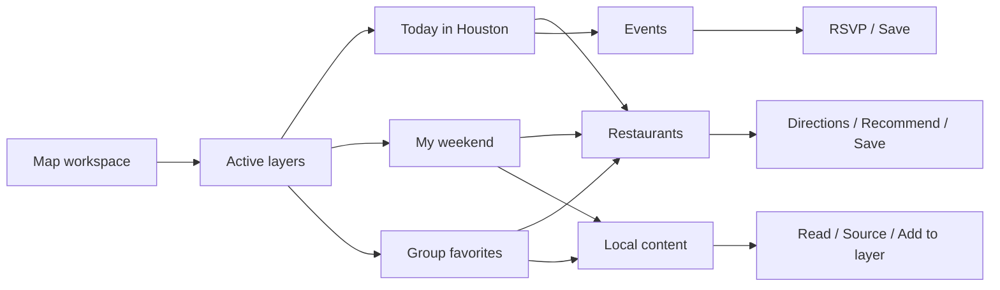

# TaiwanHub: map-first, layer-led UI/UX guide

Design and implementation specification · September 21, 2026

**Make the map the home experience. Let people apply layers of restaurants, events, and local content to decide where to go, what to do, and what to share with their community.**

Keep TaiwanHub's existing bright visual language: pale mint canvas, white surfaces, dark green text, lime actions, restrained coral/yellow accents, rounded cards, authentic photography, and English/Traditional Chinese support. Change the information architecture and interaction model around that identity.

This is a proposed migration, based on the current repository's source. It does not implement the new application or claim a browser usability audit. New routes, components, data entities, limits, and performance budgets below are proposed requirements. Examples of layers and their contents are illustrative, not claims about real businesses or groups.

## 1. Scope and relationship to the style guide

Use this document as the product and interaction specification for the next experience. It supersedes the home-feed hierarchy, five-destination navigation, and optional-map direction in the [earlier modernization guide](ui-ux-modernization-guide.md). Continue using that guide's palette, typography, spacing, shape, accessibility, photography, and bilingual principles.

The source of truth for implemented tokens is [globals.css](../apps/web/src/app/globals.css). The [bright reference CSS](design/taiwanhub-bright-reference.css) and [palette](design/taiwanhub-bright-palette.svg) remain useful design references; they are not extra stylesheets to load on top of the app.

Deliver the complete direction in stages:

1. Map home, curated public layers, daily discovery, synchronized results and details.
2. Personal layers, existing saves integration, creation and public sharing.
3. Group-owned layers with membership and permissions.
4. General local content with location rules and moderation.

The target includes all three item types and all three requested contexts. An intermediate release must clearly identify which capabilities are available. Avoid presenting group collaboration or general content as shipped until their backing services exist.

## 2. Product model: map → layers → items → actions

The map answers **where**. A layer answers **through whose perspective, for what purpose, and when**. An item supplies the place, event, or content a person can act on.

Examples:

| Layer                       | Owner/context              | Time behavior    | Contents                                                             |
| --------------------------- | -------------------------- | ---------------- | -------------------------------------------------------------------- |
| Today in Houston            | TaiwanHub editorial/system | Rolling daily    | Events overlapping today, editorial food picks, timely local content |
| Weekend with friends        | Personal                   | Fixed date range | Restaurants, events, and planning notes                              |
| Taiwanese student favorites | Group                      | Evergreen        | Member-curated restaurants and local guides                          |
| Saturday club outing        | Group                      | Specific date    | Meeting place, event, and a practical note                           |
| Want to try                 | Personal                   | Evergreen        | Saved restaurants and selected content                               |

**Daily, group, and personal are not mutually exclusive layer types.** A group can own a daily layer; a person can create an evergreen layer or a dated outing. Store these as separate dimensions and present simple presets in the UI.



### Layer contract

| Dimension          | Proposed values                                  | User-facing rule                                                           |
| ------------------ | ------------------------------------------------ | -------------------------------------------------------------------------- |
| Owner              | System, user, group                              | Show the owner under the title                                             |
| Audience           | Public, private, group members                   | Default personal layers to Private and group layers to Group members       |
| Schedule           | Evergreen, fixed day, fixed range, rolling today | Explain whether the date changes automatically                             |
| Membership         | Curated items or a system-managed rule           | User/group layers start curated; reserve automated rules for system layers |
| Item types         | Restaurants, events, content; mixed allowed      | Type chips filter the active collection                                    |
| Lifecycle          | Draft, active, archived                          | Archive preserves the layer and its references                             |
| Publication review | Unsubmitted, pending, approved, rejected, hidden | Separate public moderation from lifecycle and private editing              |

A restaurant is an existing `place` with an appropriate category. Preserve broader place categories such as groceries and cafes; use “Places” where a layer includes more than restaurants. “Content” means a local tip, short guide, photo note, or sourced link. Its exact location can be optional.

### Vocabulary that prevents ambiguity

- **Apply to map:** turn a layer on for this map session.
- **Hide from map:** turn it off without deleting or unfollowing it.
- **Follow layer:** retain a public/group layer in the library for future use; does not automatically apply it.
- **Save:** preserve the existing personal bookmark action.
- **Add to layer:** include an existing item in a chosen editable layer.
- **Create layer:** make a collection, starting private or restricted to its group.
- **Share layer:** copy a link whose audience is explicitly displayed.

Do not overload a bookmark icon to mean Apply, Follow, and Add. Use labeled controls until testing demonstrates a familiar interaction.

## 3. Current repository: what changes and what carries forward

The earlier guide includes findings that have since been fixed. The current source already has bright tokens, route-family navigation, city-aware queries, localized map labels, and token-based map pin color. Preserve those improvements.

| Current surface or capability | Verified current behavior                                                                                         | Target                                                                                |
| ----------------------------- | ----------------------------------------------------------------------------------------------------------------- | ------------------------------------------------------------------------------------- |
| Home                          | Compact city/search header followed by place, event, and optional product sections                                | Map workspace with applied layers and contextual results                              |
| Navigation                    | Home, Explore, Events, Saved, Profile                                                                             | Map, Layers, Saved, Profile; creation is a labeled action                             |
| Explore/catalog               | Places support optional map beside a paginated list                                                               | Layer-aware map/results are the primary discovery surface                             |
| `MapView`                     | Imports Mapbox dynamically; creates markers from the current items; effect recreates map when items/locale change | Persistent map instance, mixed item types, clustering, selection and viewport queries |
| Map links                     | Popup destination is always `/places/{slug}`                                                                      | Resolve destination from item kind                                                    |
| Map scope                     | Receives the current catalog page of 12 results                                                                   | Query map geometry independently from list pagination                                 |
| Events                        | Date/organizer filters, RSVP and capacity rules                                                                   | Event layers plus dated map filters; reuse RSVP behavior                              |
| Saved                         | Separate place, event, product bookmarks                                                                          | Preserve saves; expose a read-only “My saves” layer projection                        |
| Organizations                 | Profiles and follows                                                                                              | Keep as publishers; a group needs separate membership/roles                           |
| Product sightings             | Product-to-place observations                                                                                     | Optional sourced content at the observed store; keep inventory disclaimer             |
| Generic content/layers        | No dedicated post, layer, group-membership or layer-follow models                                                 | Add explicit domain entities; do not relabel catalog tables as layers                 |
| Ingestion                     | Source records, candidates, review, generated feeds                                                               | Feed approved data into system layers; ingestion does not grant publication approval  |
| Footer/demo notice            | Global footer and demo banner after page content                                                                  | Map shell has compact notices and About access; conventional pages retain footer      |

Retain Better Auth, shared validation, city resolution, `Photo`, recommendation scores with response counts, authoritative mutation refresh, source attribution, moderation, feature flags, and indexable detail pages. Do not rebuild these to achieve a different home layout.

## 4. Information architecture and routes

### Primary destinations

| Destination | Job                                            | Principal contents                                              |
| ----------- | ---------------------------------------------- | --------------------------------------------------------------- |
| Map         | Explore the current city through active layers | Map, search, date, type filters, active layers, results/details |
| Layers      | Discover and manage collections                | Discover, Following, Mine, Groups; layer preview and creation   |
| Saved       | Retrieve bookmarked items                      | Existing item list plus “Show on map” and “Add to layer”        |
| Profile     | Manage identity and participation              | Preferences, contributions, groups, language, account           |

Desktop uses the existing 72 px header with these destinations. Mobile uses four labeled bottom destinations. “Create layer” lives in Layers and the layer panel; “Add to layer” lives on item details. This keeps creation discoverable without treating it as a navigation page.

### Route migration

| Route                                                                   | New responsibility / migration                                                              |
| ----------------------------------------------------------------------- | ------------------------------------------------------------------------------------------- |
| `/`                                                                     | Canonical map workspace                                                                     |
| `/layers`                                                               | Layer library; selected library tab may be a query parameter                                |
| `/layers/[slug]`                                                        | Layer preview/detail with owner, audience, description, schedule and contents               |
| `/layers/new`                                                           | Authenticated layer creation                                                                |
| `/layers/[slug]/edit`                                                   | Authorized layer editing                                                                    |
| `/groups/[slug]`                                                        | Group identity, member access and group layers, in the group phase                          |
| `/content/[slug]`                                                       | Standalone approved content detail, in the content phase                                    |
| `/places/[slug]`, `/events/[slug]`                                      | Preserve canonical details, metadata and direct links                                       |
| `/products/*`, `/organizations/*`                                       | Preserve enabled catalog/detail destinations; expose via relevant layers/results            |
| `/explore`, `/places`, `/events`, `/search`                             | Retain working list pages during migration, add Map entry with equivalent supported filters |
| `/saved`, `/profile`, `/profile/contributions`, `/submit/*`, `/admin/*` | Retain capabilities and restyle only as needed                                              |
| `/city/[slug]`                                                          | Validate city and open the map with that city selected                                      |

After parity is verified, `/explore` can redirect to the map. Do not blanket-redirect useful indexable catalog pages or silently drop incoming filters. A fresh detail URL renders a full page. In-map selection opens a contextual detail panel and offers “Open full details.”

Navigation highlighting follows the actual destination: Map for `/`, Layers for `/layers/*`, Saved for `/saved`, Profile for profile routes. Standalone catalog/detail pages can retain their own local breadcrumb without incorrectly selecting Layers. Extend the existing route-family helper rather than duplicating matching logic.

## 5. Map home composition

### Desktop: 1100 px and wider

The map fills the available width and height beneath the app header. Do not place it inside the existing 1280 px content container. Keep text and controls within readable panel widths.

```text
┌────────────────────────────────────────────────────────────────────────────┐
│ 台 TaiwanHub    Map   Layers   Saved             Houston ▾   繁中   Profile │
├──────────────────────┬─────────────────────────────────────────────────────┤
│ Search Houston…      │ Today ▾    All · Restaurants · Events · Content    │
│                      │                                                     │
│ On your map       2  │             MAP CANVAS                              │
│ ✓ Today in Houston  │       [restaurant]            [event]               │
│ ✓ Group favorites   │                        [cluster 8]                  │
│ + Find layers        │                                                     │
│                      │                 Search this area                    │
│ Layers | Results     │                                                     │
│ 18 results in area   │                                  Zoom + / −        │
│ Compact result rows  │                                  My location       │
│ ...                  │                                  Fit results       │
│                      │                         [selected item preview]     │
├──────────────────────┴─────────────────────────────────────────────────────┤
│ Demo notice when applicable                       Provider attribution     │
└────────────────────────────────────────────────────────────────────────────┘
```

- Left panel: 320–360 px initially; independent vertical scrolling. Search and the applied-layer summary remain available above its Layers/Results tabs.
- Main canvas: flexible remainder, at least 600 px when the side panel is expanded. Collapse the panel when that cannot fit.
- At 1440+ px, selection may open a 360–400 px right detail panel. Between 1100–1439 px, details replace left-panel contents with a “Back to results” control. Do not squeeze the map between two rails.
- Date/type controls sit on opaque white surfaces. Keep map labels visible around them.
- Use one primary lime action per panel state: for example Apply to map in layer preview or RSVP in event details. Secondary actions use quiet borders or text.
- Footer links move into an accessible About/help panel in the map shell. Preserve a visible compact demo notice when demo content is present, with expanded explanation available.

### Tablet: 801–1099 px

Use a collapsible 320 px side panel with the map filling the rest. If navigation or bilingual labels cannot fit, use the compact header. A selected detail replaces the panel. Do not show three columns. In portrait or short-height layouts, support the mobile sheet arrangement.

### Mobile: 320–800 px

```text
┌─────────────────────────────┐
│ 台   Houston ▾          繁中 │
│ Search this city…           │
│ Today ▾   Types ▾  Layers 2 │
│                             │
│         MAP CANVAS          │
│   [food]        [event]     │
│          [8]                │
│                   + / −    │
│ Search this area   Locate  │
│ Attribution                │
├─────────────────────────────┤
│ Results 18        Expand ↑ │
│ Today · Group favorites    │
│ Selected or first result   │
├─────────────────────────────┤
│ Map   Layers  Saved Profile│
└─────────────────────────────┘
```

Use a single shared bottom sheet for results, layers, and item details. Switching modes changes the sheet contents and preserves the previous scroll position. Never stack a detail sheet above a layer sheet above a results sheet.

| Sheet state | Recommended size                    | Behavior                                             |
| ----------- | ----------------------------------- | ---------------------------------------------------- |
| Peek        | About 128–160 px, content-dependent | Summary plus one row; map remains the hero           |
| Half        | About 45–55% of available workspace | Scan results, inspect a layer or preview an item     |
| Expanded    | Available workspace below search    | Accessible list/detail mode; explicit collapse/close |

Provide labeled Expand/Collapse buttons; dragging is an enhancement. On narrow screens the active-layer summary is a single button such as “2 layers,” not a row of overflowing chips. At 320 px, move type/date options into a compact filter sheet if necessary.

Size the shell with the dynamic viewport and measured header/navigation/notice heights. Reserve the safe area once. Keep sheet actions above bottom navigation; keep provider attribution above the sheet and map controls away from covered areas. Resize map padding whenever panels change so a selected pin remains visible. On short screens, large text, or an open keyboard, allow expanded list/form mode to occupy the workspace.

## 6. Preserve the exact visual language

### Style-to-component mapping

| Existing token/rule                           | Map and layer application                                              |
| --------------------------------------------- | ---------------------------------------------------------------------- |
| Canvas `--th-canvas: #F7FCF8`                 | Loading canvas and workspace background                                |
| Surface `--th-surface: #FFFFFF`               | Search, controls, layer cards, detail panels                           |
| Soft surface `--th-surface-soft: #EFF8F1`     | Selected rows and low-emphasis groupings                               |
| Text `--th-text: #14261F`                     | All principal labels; icon foregrounds on bright fills                 |
| Muted `--th-muted: #53665C`                   | Owner, schedule, address and secondary descriptions                    |
| Primary `--th-primary: #C7F464`               | Main CTA, applied-layer check, selected-pin halo                       |
| Brand `--th-brand-text: #006A51`              | Links, active labels and recommendation text                           |
| Mint `--th-mint: #27D8A1`                     | Restaurant/place marker fill and small community accents               |
| Coral `--th-coral: #FF846B`                   | Event marker fill and limited event accents                            |
| Sun `--th-sun: #FFD76A`                       | Content marker fill and date blocks                                    |
| Divider `--th-divider: #DDE9E0`               | Quiet panel and row divisions                                          |
| Control border `--th-control-border: #7B8F83` | Fields, switches and identifiable controls                             |
| Focus `--th-focus: #2855D9`                   | Visible keyboard focus                                                 |
| Existing semantic success/warning/error pairs | Saved, review pending, failed requests; never replaced by layer colors |

Marker type uses **icon + label + color**: utensils/place symbol, calendar, document. Use a dark outline and white outer separation so bright fills remain distinct from the base map. A selected marker gets a lime halo, heavier outline and matching selected row. Keyboard focus remains blue and distinct from selection.

Color identifies item type consistently across layers. Layer identity comes from its title, owner/avatar, and membership badges. Do not assign a random saturated color to each layer or recolor an event whenever another layer contains it.

### Base map and surface treatment

Start with the current light base map. Tune its visual density only where the existing provider style supports it: quiet streets, subdued land/parks/water, readable neighborhood and major road names. Keep the bright accents on TaiwanHub controls and its items. Suppress competing generic POI labels where supported and appropriate. Preserve provider attribution. A custom map-style project is optional; changing map vendors is outside this migration.

Use white opaque controls with quiet borders and restrained elevation. Avoid translucent text surfaces that change contrast with the map underneath. Photography belongs in result rows, layer previews and detail panels, rather than decorative backgrounds over the map.

### Typography, geometry and motion

- Preserve the system font stack with `PingFang TC` and `Microsoft JhengHei` fallbacks.
- Use 24/32 px panel headings, 18/25 px desktop and 17/24 px mobile row titles, 16/24 px body/inputs, 13/19 px metadata, and 12/16 px bottom navigation labels.
- Preserve 4/8/12/16/24/32/48/64 px spacing; use 12–16 px inside rows and 16–24 px panel padding.
- Preserve 10 px fields, 14 px cards, 20 px sheets, and pill actions. Use 48 px controls and intended touch areas of at least 44 px.
- Keep the existing 120/180/240 ms motion tokens. Fade data changes and use short panel transitions; avoid bouncing pins, pulsing decorations or automatic camera tours. Respect reduced motion.
- Traditional Chinese labels wrap naturally. Translate interface labels, use provided bilingual item titles, and fall back to original content when no translation exists.

Add only semantic aliases such as `--th-map-place`, `--th-map-event`, and `--th-map-content` referencing the existing palette, plus map-specific layout variables. Keep current stylesheet ownership and import order; remove obsolete selectors when markup is removed. Do not layer another theme override file over existing responsive rules.

## 7. Layer component specification

### Layer card

Each card has a title, owner identity, audience label, schedule, brief description, content mix/count, and a clear Apply control. An optional small cover thumbnail can communicate editorial character. Prefer a compact row for active layers and a larger card for discovery.

Example: **Weekend with friends** · By you · Private · Sep 26–27 · 8 places, 2 events, 1 note. “Apply to map” is the primary action. A separate overflow menu contains Rename, Edit contents, Share, Archive, and Delete when permitted.

“Applied” is a checked state with a visible label. Counts in the library describe the authorized layer contents; counts in the map panel describe the current query. Never mix “11 items in this layer” with “4 results in this area.” Hidden/private counts are never shown to unauthorized viewers.

### Active-layer panel

Show each applied layer with its checkbox, title, owner, schedule, load/error state and visible contribution count. “View layer” opens the layer preview without changing application state. “Show only this layer” is explicit and reversible through Back/Undo.

Start new visitors with one system layer, **Discover Houston**, applied. It includes approved local places and upcoming events, with content added only when available. Offer **Today in Houston** as the next obvious preset. Use a default date scope of Upcoming so new visitors do not accidentally hide most event data. Limit the first release to five simultaneously applied layers, with copy asking users to hide one before applying another. This is a proposed usability limit to validate, not a known system restriction.

Reordering changes panel and optional curated-list order only; it does not change which layer “wins” a pin. Provide Move up/down actions if reordering is offered.

### Layer preview/detail

Show title, owner, audience, schedule, last updated, purpose, contents and source information. The primary action is Apply to map; Follow is separate. A restricted group layer explains who may access it. An inaccessible direct link uses a neutral unavailable/access-required message without exposing its title or items.

Users can inspect a layer before applying it. Applying preserves other layers and keeps the current viewport by default; “Fit layer” is a separate action. Opening a shared layer for the first time applies that layer alone and fits its mapped extent so the recipient sees a coherent starting view.

### Library

Discover shows a finite curated set of public layers grouped by intent: Today, Food, This weekend, Community. Following stores followed public/group layers. Mine contains private/public personal layers and drafts. Groups contains only authorized group collections. Search matches title, owner and purpose. Avoid an infinite social feed.

## 8. Map behavior, selection and overlapping items

1. Resolve the city from validated URL, then stored preference, then Houston. Extend city data access to supply its stored center; `getCities()` currently does not return coordinates. Do not center the map on the first result.
2. Load public layer summaries and useful results before the map provider is ready. Show a quiet map skeleton and working list controls.
3. Applying layers takes the **union** of their eligible items. Date, type, search and committed area filters intersect that union.
4. Deduplicate by stable item identity, such as `place:{id}` or `event:{id}`. One item appearing in three layers has one pin and one result row with “In 3 layers.”
5. Keep different items at the same venue distinct. At a broad zoom, cluster them; at maximum useful zoom, open an “At this location” list. Do not invent offset coordinates.
6. Selecting a row or pin selects the same entity, opens the shared detail surface and highlights its counterpart. Clear selection when its last active membership disappears or a filter excludes it; announce why.
7. Panning changes the visible camera, then reveals **Search this area**. Committing it refreshes both results and pins against those bounds. Until committed, label existing results as belonging to the previous search area. Fit/zoom alone does not silently change the dataset.
8. Keep the camera stable when saving, RSVPing, applying a layer, refreshing results or changing language. “Fit results,” “Fit layer,” city changes and explicit location/search-result selections may move it.
9. Cluster counts represent unique mapped entities matching the query, never the sum of layer memberships. Cluster selection zooms or opens an accessible contained-results list.
10. No applied layers produces “Choose a layer to start exploring” and Find layers. Do not secretly restore a hidden default layer.

For scale, render ordinary points and clusters through GeoJSON-backed map style layers, with a DOM overlay only where useful for the selected item. Mapbox documents the rendering distinction between HTML markers and style layers; validate the choice against expected density. See [Mapbox's markers/layers guidance](https://docs.mapbox.com/help/dive-deeper/markers-vs-layers/) and [cluster example](https://docs.mapbox.com/mapbox-gl-js/example/cluster/).

The product's “layer” is a saved collection. A Mapbox rendering layer is an internal drawing primitive. Keep those concepts separate in types and user copy.

## 9. Dates and daily layers

The date control filters items within applied layers; it does not create or edit a layer. Offer Upcoming, Today, This weekend and Pick dates. Show the chosen city's timezone in date details; Houston uses its configured `America/Chicago` zone.

| Item/schedule        | Date behavior                                                                                                                |
| -------------------- | ---------------------------------------------------------------------------------------------------------------------------- |
| Restaurant/place     | Remains visible unless its layer membership has an explicit validity window; do not infer opening hours                      |
| Event                | Include when its start/end overlaps the selected interval; retain a clear cancelled/postponed state in saved/curated history |
| Evergreen content    | Remains visible; show published/updated date separately                                                                      |
| Time-limited content | Filter by its explicit validity window, not simply its publication date                                                      |
| Fixed-date layer     | Keep its original dates; offer “View layer dates” when the current date filter hides its timed items                         |
| Rolling Today layer  | Resolve at the city's local day boundaries and clearly label automatic daily changes                                         |

Use half-open intervals: `item.start < window.end && item.end > window.start`. Resolve Today from local midnight to the next local midnight, not a fixed 24-hour duration. This weekend means Saturday 00:00 to Monday 00:00 in the selected city; on Saturday/Sunday it means the ongoing weekend. Upcoming begins now and includes ongoing events until their end; result pagination must bound delivery.

Fixed-date collections retain restaurants and notes after the date passes; timed entries remain available in a labeled past/history view. Browsing past layers requires a new query mode because current event listing excludes ended events. Do not bypass approval/moderation checks when adding history support.

At midnight, display “A new day is available” with Refresh rather than changing an open plan underneath the user. Reopening a rolling Today layer resolves the current city-local day. Save/share a fixed date when the user wants a reproducible daily view; a rolling link must visibly say it updates daily.

Daily picks mean curated for that day. They do not assert “Open now,” live stock, available tickets, or a live occupancy signal. None should be introduced without dependable supporting data.

## 10. Content that does not have a precise map point

Every item has a location status: exact public venue, approximate area, city-wide, online, or unspecified. Do not force a geographic point merely to satisfy the map layout.

- Restaurant: use its validated public location.
- In-person event: use its venue coordinates; retain distinct event identity.
- Place-linked tip/photo/link: reference the place; reuse its public location and attribute the content author/source.
- Neighborhood guide: show an area outline only when a real boundary exists. Otherwise keep it in the list with a neighborhood label. Do not fabricate a centroid pin that implies a venue.
- Online or city-wide content: show under **Also in these layers** below mapped results, labeled Online or City-wide.
- Missing location: keep it accessible in the layer list and offer authorized editors “Add location.”

Use a summary such as “18 mapped results · 3 without a map location.” Non-point items are excluded from pin/cluster counts. In area searches, exact points follow the bounds; known area geometry uses intersection; city-wide/online/unknown items remain in the clearly separate section with “Not limited to this map area.” Type/date/search filters still apply to both sections.

General content v1 supports short text, an optional image, an optional source link, and an optional linked place/event. Validate and moderate content before public discovery. Preserve private author content under its own access rules. Product sightings, when enabled, are a specialized sourced item at the store with observed date and “Availability may have changed.” Organization profiles are publishers, not invented map pins.

## 11. Detail surfaces and primary actions

| Item             | Order of information                                                                                    | Primary action                   | Supporting actions                                 |
| ---------------- | ------------------------------------------------------------------------------------------------------- | -------------------------------- | -------------------------------------------------- |
| Restaurant/place | Photo; name/category; neighborhood/address; score + response count; practical details; layer membership | Directions                       | Save, Add to layer, Recommend, full details/source |
| Event            | Date/time/status; title; venue/organizer; capacity/RSVP state; layer membership                         | RSVP when supported              | Directions, Save, Add to layer, organizer/source   |
| Content          | Title/type; author; published/updated; location relevance; body/image/source                            | Read full content or Open source | Save, Add to layer, Report                         |
| Product sighting | Product/store; observed date; source; stock disclaimer                                                  | Store details/directions         | Existing product Save, Add to layer when enabled   |

Do not show a recommendation score on generic content or events simply because the old map popup expects a score field. Reuse the existing action services and their loading/success/error states. Track pending actions individually; a pending Save should not make an unrelated Directions action unavailable.

Public details can be read as a guest. Save, Recommend, RSVP, Follow and layer editing prompt sign-in only when invoked. Preserve the intended action and return context. Resume by presenting the original action after sign-in; do not silently execute an RSVP or publication. Directions remains usable without signing in.

## 12. Personal creation, saving and editing

### Create a layer

1. Choose “Create layer” in Layers or “New layer” from Add to layer.
2. Enter title and optional short purpose. Default city to the current city and owner to the user.
3. Choose schedule: Anytime, A day, Date range. Explain dates in the city's timezone. Rolling Today creation remains system-managed in v1.
4. Show **Private — only you can view** before saving. Group creators can select an authorized group, defaulting to Group members.
5. Save the empty layer immediately as a draft, then add existing items through search/map selection. Present a map preview and list of contents.
6. “Done” activates the private/group layer. Public publication is a separate reviewed action when enabled.

A first layer requires only a title. Do not require a cover image, description, coordinates or multiple items. Preserve form input on validation/network errors. Warn before leaving an unsaved edit; an empty saved draft remains editable.

### Add to layer

The picker lists only layers the actor can edit, with audience and existing membership. Selecting an already-added item shows “Added” rather than duplicating it. In the first release, choose one destination per submission; keep multi-select bulk operations for later if needed. A layer in another city is disabled with an explanation; v1 layers are city-scoped. A multi-city future can use several city-scoped layers.

Adding an item creates a reference, not a copy of its canonical place/event. Optional curator notes belong to that layer membership and follow that layer's audience. Notes in a private layer must not surface through a public copy of the same restaurant.

### Existing Saved behavior

Keep current saved-place/event/product tables authoritative. “My saves” is a private system projection over those records, not a second migrated collection that can drift. New content saves need an explicit persistence path in the content phase. Unsave updates the projection but does not remove the item from separately curated personal layers. “Add to layer” does not automatically Save. Explain these as two distinct choices in the picker.

My saves cannot be made public directly. Offer “Create a layer from selected saves” if public sharing is desired, with selected items and audience reviewed before publishing.

### Editing and lifecycle

Owners can rename, edit purpose/schedule, add/remove/reorder items and archive. Removing an item from a layer leaves the source entity, votes, RSVPs and other layers intact. Show Undo for reversible removals. Archived layers disappear from default discovery but remain in the owner's archive; deletion requires an explicit confirmation naming the layer. Do not allow deletion of a projected/system layer through personal controls.

## 13. Group layers, sharing and access

Group ownership requires membership, distinct from following an organization. A follow relationship never grants editing or access to restricted items.

| Actor           | Read group layer           | Apply       | Edit contents | Manage audience/members | Delete/transfer |
| --------------- | -------------------------- | ----------- | ------------- | ----------------------- | --------------- |
| Guest/nonmember | Approved public layer only | Public only | No            | No                      | No              |
| Group viewer    | Yes                        | Yes         | No            | No                      | No              |
| Group editor    | Yes                        | Yes         | Yes           | No                      | No              |
| Group owner     | Yes                        | Yes         | Yes           | Yes                     | Yes             |

Personal layers have a single owner in v1; group roles belong to the group and inherit into its layers. System collections are read-only to ordinary users. Keep a last owner until ownership is transferred. Invite acceptance requires the intended signed-in account and an expiring/revocable invitation. Join requests, chat and real-time multiplayer editing are beyond the initial group release.

Sharing behavior:

- Public approved layer: copy its canonical layer URL; guests can preview and apply.
- Private layer: explain that the URL remains owner-only. “Publish layer” requires an audience preview and review, not an automatic visibility change during Copy link.
- Group layer: copy a link labeled “Group members only.” The link never grants membership.
- Shared map view: include only approved public layer references. If private/group layers are active, explicitly offer a preview excluding them or share a single restricted layer link. Do not claim the recipient will see all current items.

For v1, defer anonymous unlisted links to avoid adding a second access mechanism. Check permissions on summaries, counts, item queries, exports, images and writes. Group/private responses must not enter shared public caches. Recheck membership after access changes and remove unauthorized data from the UI/cache on the next authorization refresh; return a clear access-changed state on subsequent requests.

Show “Updated by …” and revision metadata for group changes. Use version checks on edits; if a second editor changed the same layer, preserve the draft and offer reload/review instead of silently overwriting. New public text and curator notes follow moderation. Visibility of a layer never makes hidden or rejected source content public. Moderator removal must affect every referencing layer.

## 14. Critical user journeys

| Journey                    | Steps                                                                             | Success state                                                  |
| -------------------------- | --------------------------------------------------------------------------------- | -------------------------------------------------------------- |
| Find somewhere to eat      | Open Map → Discover Houston → Restaurants → select pin/row → Directions or Save   | Action completes; applied layers and camera remain             |
| Decide what to do today    | Apply Today in Houston → inspect date/scope → select event → RSVP                 | Confirmed RSVP or clear capacity/status response               |
| Build a weekend plan       | Create private dated layer → add restaurant, event and note → Apply → Fit layer   | Mixed collection appears with correct dates and locations      |
| Discover through a group   | Open an authorized group → preview favorites → Apply → inspect overlap            | Existing active layers remain; duplicate places render once    |
| Share a collection         | Open owned layer → Share → review audience → publish/review if needed → copy link | Recipient can access exactly the promised audience/content     |
| Read content without a pin | Apply a layer → open Also in these layers → read city-wide guide                  | Content remains discoverable without false coordinates         |
| Return tomorrow            | Reopen map → restore permitted layers → notice rolling-date update → refresh      | Daily layer updates; fixed-date personal layer stays fixed     |
| Work without map service   | Open map with token/network/WebGL unavailable → use same result list              | Read, Save, RSVP, layers and external directions remain useful |

## 15. Search, filtering and state persistence

Map search defaults to **In applied layers**, visible beside the field. Offer **All Houston** explicitly. Global results appear as a temporary search overlay, with ordinary layer results suspended; an “Exit search” action restores the previous applied view. Selecting a global result does not automatically change permanent layer contents. Offer Add to layer separately.

The Layers library searches collections. Map search searches items. Keep their placeholders distinct. Preserve bilingual search and existing category/organizer filters under More filters where applicable. Do not add “Near me” distance sorting without a location choice and a supported query.

### State contract

| State                                                                                               | Storage/history rule                                                                           |
| --------------------------------------------------------------------------------------------------- | ---------------------------------------------------------------------------------------------- |
| City, committed search, type/date filters, selected item, public applied layers, committed viewport | Validated map URL; serialize only supported values                                             |
| Private/group layer IDs and personal active-layer preference                                        | Authorized user-scoped session/preference state; explicit restricted layer route requires auth |
| Camera movement while dragging, hover, sheet drag position                                          | Local state; never push a history entry per frame                                              |
| Sheet mode, selected item open/close, committed filter action                                       | Deliberate history states so Back restores the prior view                                      |
| Layer Follow, Save, RSVP, contents, membership                                                      | Server persistence with authorization                                                          |
| Shared map view                                                                                     | Explicit serializer with public layers only and preview of the resulting state                 |

An illustrative public URL is `/?city=houston&layers=discover-houston&date=2026-09-26&types=restaurant,event&item=event:UUID&view=list`. Final parameter validation lives in shared schemas. Cap arrays/lengths, validate coordinates and date ranges, and reject unknown kinds. Do not place private notes or precise user geolocation into the URL or analytics.

Explicit URL state takes precedence over remembered defaults. Define `layers=none` to preserve a deliberately empty map. A canonical `/layers/[slug]` open applies that layer by itself; a library Apply adds it to the current set. Locale switching preserves query and selection. Back closes detail to its previous results before leaving the map; changing filters does not accumulate history from continuous panning.

Opening `/` without explicit state restores authorized layers for a returning user, otherwise the default system layer. Clear user-specific cached state on logout. A city switch replaces city-specific system defaults, keeps other-city personal layers in the library, clears incompatible selection and explains which layers were hidden. Never change a layer's city or owner as a side effect of map navigation.

## 16. Loading, empty, error and exceptional states

| State                            | UI and recovery                                                                                            |
| -------------------------------- | ---------------------------------------------------------------------------------------------------------- |
| First load                       | Stable shell, layer/result skeletons, quiet map placeholder; no decorative spinner-only screen             |
| One layer loading                | Loading status on that row; retain other loaded layers and their results                                   |
| One layer fails                  | Mark it unavailable with Retry/Hide; show total as partial, not complete                                   |
| No active layers                 | “Choose a layer to start exploring” + Find layers                                                          |
| No results in area               | Preserve filters; offer Fit layer or a broader committed area                                              |
| No results on date               | Show active date; offer Upcoming or View layer dates                                                       |
| All contents unlocated           | Explain “These items have no map location”; open their list                                                |
| Missing token / provider failure | Full results/layer controls with map-unavailable notice and Retry; external directions per located item    |
| Location permission denied       | Keep current city; allow manual area search; do not repeatedly prompt                                      |
| Layer archived/deleted           | Explain unavailability where authorized; remove from active results; retain other layers                   |
| Membership revoked               | Clear restricted layer data after failed authorization; neutral access-changed message                     |
| Save/Add/RSVP failure            | Restore authoritative state and keep draft/context; Retry the affected action                              |
| Offline after initial load       | Label cached data as potentially out of date; disable writes with explanation; do not promise offline maps |
| Stale async response             | Ignore older request results; pin/list state belongs to one current query version                          |
| Content hidden after selection   | Close public detail, remove item and explain it is no longer available                                     |

Reset map failure state when retrying. Dispose partially initialized map instances even if unmounted before load, and distinguish transient tile errors from a fatal initialization failure. The current error handler treats any map error as failure; the new experience needs a deliberate recovery path.

## 17. Accessibility and localization

Every discovery and action flow must work from a semantic list without map interaction. Expose a persistent “List view” control and preserve its preference. Server-render initial useful results for slow devices and map failure.

- Provide keyboard-reachable search, filters, layer toggles, result links and detail actions. Do not make hundreds of rendered pins the required tab sequence.
- Keep selection reflected in result markup; announce changed result counts and selected item through concise status messages.
- Modal filter/create dialogs trap focus, have a labeled close control, support Escape and restore focus to the trigger. A nonmodal desktop detail rail should not trap focus or disable the map/list.
- In expanded mobile sheet mode, ensure covered content is not focusable. In peek/half mode, preserve usable focus order between controls, results and map alternatives.
- Offer zoom buttons and manual area selection/search. Sheet resizing and layer reordering have single-action alternatives; W3C's [dragging guidance](https://www.w3.org/WAI/WCAG22/Understanding/dragging-movements.html) explains the need for alternatives to dragging.
- Use intended 44–48 px touch areas from the style guide. This is a product target; WCAG 2.2 AA's [minimum-target criterion](https://www.w3.org/WAI/WCAG22/Understanding/target-size-minimum.html) has a smaller 24 px baseline with exceptions.
- Verify text contrast on composed surfaces, marker separation from the map, visible focus, 200% text zoom, 320 px reflow and reduced motion. Do not disable browser zoom.
- Localize controls, counts, error states, type labels and accessibility names. Avoid mixing both languages in a single error string.
- Use city-local dates and visible timezone context on event details; do not interpret a user's travel timezone as the event timezone.

Suggested glossary for bilingual review:

| English              | Traditional Chinese  |
| -------------------- | -------------------- |
| Map                  | 地圖                 |
| Layers               | 圖層                 |
| Apply to map         | 顯示於地圖           |
| Hide from map        | 在地圖上隱藏         |
| Create layer         | 建立圖層             |
| Add to layer         | 加入圖層             |
| Follow layer         | 追蹤圖層             |
| Search this area     | 搜尋此區域           |
| Group members only   | 僅限群組成員         |
| Also in these layers | 這些圖層中的其他內容 |

Pair “Layer” with “A collection you can show on the map” in first-use help. Treat the Chinese glossary as proposed product copy requiring native-speaker review.

## 18. Engineering model and boundaries

### Proposed entities

| Entity                   | Required responsibility                                                                                                                       |
| ------------------------ | --------------------------------------------------------------------------------------------------------------------------------------------- |
| `layer`                  | ID/slug, bilingual title/description, city, owner kind/reference, audience, schedule/timezone, lifecycle, review status, revision, timestamps |
| `layer_item`             | Layer reference, one typed entity reference, curator note, order, optional validity, added by/date                                            |
| `layer_follow`           | User/layer unique relationship, independent of map application                                                                                |
| `group` / `group_member` | Group identity; user/group uniqueness; owner/editor/viewer role; invitation lifecycle                                                         |
| `content_post`           | Author, text/image/link, optional related entity, location status, validity, source, moderation/review, timestamps                            |
| `saved_content`          | Unique user/content reference preserving Save semantics for new content                                                                       |
| User map preference      | Authorized active layer IDs and view preference; no continuous location trail                                                                 |

Use explicit referential integrity for membership: for example nullable place/event/content foreign keys with a constraint requiring exactly one, or typed join tables. A free-form `kind + UUID` without integrity checks is insufficient. Enforce uniqueness per layer/entity. Keep item identity distinct from render-point identity for future area/multi-location content.

“My saves” is computed, and system rule layers use a versioned allowlisted rule specification. Do not store executable user-authored SQL or duplicate canonical catalog records. The existing ingestion `generated_feed` is not a substitute for per-user layers or group permissions.

### Query behavior

Create a map query service that resolves accessible layers, unions memberships/rules, checks source approval/access, applies date/type/search/city/area filters, deduplicates and returns stable identities. Use the same predicate for pins, result rows and counts. Evaluate permissions before counting or clustering.

Map geometry and list pagination are separate payloads over the same query. Start with bounded GeoJSON for Houston density; a proposed cap of 1,000 points can trigger a clearly labeled “Zoom in to see all results” state or a server aggregation response. Never silently clip to the first 12 or 1,000 and call it the complete map. Cursor-paginate result details independently. Return query revision, total unique matches, mapped/unmapped counts, partial status and per-layer availability.

If server aggregation becomes necessary, cluster counts must account for the complete authorized query; do not cluster only an arbitrary truncated subset. Use current PostGIS indexes for area queries where geometry is populated, and audit/backfill latitude/longitude-to-geometry consistency first.

### Proposed endpoints

| Endpoint                                | Responsibility                                          |
| --------------------------------------- | ------------------------------------------------------- |
| `GET /api/v1/layers`                    | Search authorized layer summaries by library scope      |
| `GET /api/v1/layers/:id`                | Authorized definition/preview and revision              |
| `POST /api/v1/layers`                   | Create with validated ownership, private/group default  |
| `PATCH /api/v1/layers/:id`              | Authorized, version-checked metadata/lifecycle changes  |
| `POST/DELETE /api/v1/layers/:id/items`  | Idempotent add/remove of typed references               |
| `POST/DELETE /api/v1/layers/:id/follow` | Follow/unfollow independently of applying               |
| `POST /api/v1/layers/:id/publish`       | Audience review and moderation workflow                 |
| `GET /api/v1/map`                       | Validated layer/filter/area geometry and summary query  |
| `GET /api/v1/map/results`               | Paginated rows using the same query contract            |
| `POST /api/v1/content`                  | Authenticated content draft/submission in content phase |

Group/member endpoints are added with the group phase and must enforce the permission table. The route list is a design contract, not a claim that endpoints currently exist. Reuse established API error/validation conventions. Writes must derive the actor server-side; public layer access never grants canonical entity editing.

### UI composition

Keep a persistent client map boundary and a shared map-state controller. Separate map initialization/cleanup from source, locale and selection updates. Load entity details only when selected. Reuse existing detail display/actions in both the panel and canonical page.

Proposed components: `MapWorkspace`, `MapCanvas`, `MapToolbar`, `ActiveLayersPanel`, `LayerCard`, `LayerPicker`, `MapResults`, `ItemPreview`, `MapBottomSheet`, `LayerEditor`, and `MapUnavailableState`. Extract components when the corresponding phase needs them; avoid building empty abstractions in advance.

## 19. File-by-file implementation plan

| File/boundary                                                 | Work                                                                                                    |
| ------------------------------------------------------------- | ------------------------------------------------------------------------------------------------------- |
| `apps/web/src/app/page.tsx`                                   | Replace home sections with initial map workspace and server-loaded default layer/results                |
| `apps/web/src/app/layout.tsx`                                 | Support map shell height/footer behavior without breaking conventional pages, skip link or demo notice  |
| `apps/web/src/components/navigation.tsx`                      | Four destinations, active route rules and city changes that update map URL/context                      |
| `apps/web/src/components/map-view.tsx`                        | Extract persistent canvas; typed destinations; source updates, clustering, selection, retry and cleanup |
| `apps/web/src/components/cards.tsx`                           | Reuse photo/score/metadata patterns; add compact map rows and membership context                        |
| `apps/web/src/components/actions.tsx`                         | Reuse existing mutations; add separate Add to layer and per-action pending state where needed           |
| `apps/web/src/app/[section]/page.tsx`                         | Preserve list routes; add equivalent Map links; stop treating current-page map data as the full city    |
| `apps/web/src/app/[section]/[slug]/page.tsx`                  | Extract reusable detail content/actions and retain canonical page metadata                              |
| `apps/web/src/app/search/page.tsx`                            | Preserve bilingual/city search; link results to the map or canonical details                            |
| `apps/web/src/app/saved/page.tsx`                             | Keep saves; add My saves map projection and Add to layer                                                |
| New static `app/layers/*`, `app/groups/*`, `app/content/*`    | Add phase-appropriate routes; verify interaction with current dynamic section routes                    |
| New `features/layers` and `features/map`                      | Authorization-aware layer services and one consistent map query contract                                |
| `apps/web/src/features/catalog/repository.ts`                 | Reuse catalog enrichment/ranking; add typed map adapters and explicit historical event query behavior   |
| `apps/web/src/lib/city.ts` and city repository query          | Extend center/bounds metadata; preserve validated URL → preference → default resolution                 |
| `apps/web/src/lib/i18n.ts`, `dictionary.ts`                   | Add bilingual copy and types using the existing export boundaries                                       |
| `apps/web/src/lib/analytics.ts`                               | Extend existing tracking with map/layer events                                                          |
| `apps/web/src/lib/config.ts`                                  | Proposed map/layer rollout switches alongside existing feature flags                                    |
| `apps/web/src/app/globals.css`, `pages.css`, `responsive.css` | Reuse tokens, own map layouts, consolidate obsolete catalog/home overrides                              |
| `packages/shared/src/index.ts`                                | Layer/query/access schemas and discriminated item types                                                 |
| `packages/database/src/schema.ts`, migrations                 | Layer/content/group persistence, constraints and query indexes                                          |
| `apps/web/src/app/api/v1/[...path]/route.ts`                  | Extend established API routing with validated service calls                                             |
| `tests/unit`, `tests/integration`, `tests/e2e`                | Semantic, permission and browser regression coverage                                                    |

Before implementation, read applicable `AGENTS.md` and the installed Next.js documentation as required by this repository. Preserve current uncommitted work; this guide is not permission to reset the working tree.

## 20. Delivery phases and acceptance gates

### Phase 0 — Baseline and interaction prototype

Inventory current routes/actions and capture desktop/mobile EN/繁中 baselines. Prototype map/layer/selection/sheet states using labeled demo data. Confirm people understand Apply, Save and Add to layer. Establish initial data-density and response-time measurements. Freeze the inherited tokens; no parallel visual rebrand.

**Exit:** reviewed desktop/mobile flows, style checklist and typed layer/query contract.

### Phase 1 — Map-first discovery

Ship persistent map home, Discover Houston and Today system presets, mixed place/event pins, clustering, query/list consistency, date/type/search controls, detail previews, URL restoration and full list fallback. Preserve canonical routes and community actions. System layer definitions can initially be server-owned configuration if their interface matches the durable layer contract.

**Exit:** a guest can find food and an event from Map, use directions and complete authenticated Save/RSVP without losing context. No pagination-hidden pins. EN/繁中 and map failure work.

### Phase 2 — Personal layers

Ship persistence, library, private creation/editing, typed memberships, My saves projection, follow, and a reviewed public publication/share flow. Migrate no existing saves destructively.

**Exit:** a user builds a fixed-date plan, applies it with a system layer, sees duplicates once, returns to it, and shares only what the intended audience can access.

### Phase 3 — Group layers

Ship groups, invites, member roles, restricted layers, edit revisions and revocation handling. Preserve organizations as publishers and link them only through an explicit ownership model.

**Exit:** viewers cannot edit; editors cannot change audience/membership; unauthorized requests reveal no restricted content/counts; conflicting edits are recoverable.

### Phase 4 — General content

Ship content creation/review, content saves, explicit location statuses, city-wide/unlocated results and source attribution. Add product-sighting adapters only when the products feature is enabled.

**Exit:** a restaurant, event and local content item can coexist in a personal or group layer; non-point content stays discoverable and never creates a misleading pin.

### Phase 5 — Rollout and cleanup

Roll out behind a proposed `FEATURE_MAP_HOME` switch, with a separate layer-write switch where useful. Keep legacy list routes during validation. Record map provider failures and outcome metrics. Remove obsolete home/map CSS after parity passes. A rollback restores the old entry screen without deleting new layers, memberships or saved data.

**Exit:** critical journeys and permission tests pass, style parity is reviewed, performance meets measured budgets, and support/fallback paths work in production-like conditions.

## 21. Verification, metrics and definition of done

### Required behavioral tests

| Level             | Scenarios                                                                                                                                                                                                               |
| ----------------- | ----------------------------------------------------------------------------------------------------------------------------------------------------------------------------------------------------------------------- |
| Unit              | Union/deduplication; type/date/area intersection; fixed versus rolling schedule; midnight/DST boundaries; typed destinations; state serialization; per-kind counts                                                      |
| Integration       | Group roles and revocation; unauthorized count leakage; content moderation propagation; idempotent add/follow; My saves consistency; version conflicts; pin/list query parity; historical event access                  |
| Browser           | Apply/hide two layers; duplicate place; same venue multiple events; pin ↔ row selection; Back/reload; Save/RSVP return; create/edit/share; keyboard-only list flow; provider failure; locale switch; denied geolocation |
| Responsive/visual | 320/390/768/1024/1440 px; short landscape; long Chinese titles; text zoom; safe area; open keyboard; attribution; sheet/action/navigation overlap                                                                       |

Implementation should run the repository's actual commands: `pnpm lint`, `pnpm typecheck`, `pnpm test`, `pnpm test:integration`, `pnpm test:e2e`, and `pnpm build`. Use a dedicated migrated test database for integration/browser checks. A documentation-only change does not establish that the proposed app passes these tests.

Proposed initial budgets: useful server-rendered controls/results within 2.5 seconds on the agreed mobile test profile; layer toggles visibly acknowledge input within 100 ms; warm layer results settle within 1 second at expected Houston density. Measure p75 on the chosen device/network and adjust budgets explicitly if needed. Keep previous results usable during refresh, cancel obsolete requests, and avoid downloading full images/bodies for all pins. These are targets, not measured results.

### Outcome metrics

Use the current analytics abstraction. Add `map_opened`, `layer_previewed`, `layer_applied`, `layer_hidden`, `layer_created`, `layer_followed`, `layer_item_added`, `map_item_selected`, `map_area_searched`, `map_fallback_used`, and `layer_share_link_copied`. Retain actual Save/RSVP/Recommend success events. A copied link is not evidence that a recipient viewed it.

Primary measure: proportion of map sessions leading to a useful action such as directions, Save, RSVP or adding to a personal plan. Compare time to first useful action with the existing experience. Track repeat use of personal/followed layers, creation completion, empty-map rate, fallback rate and permission errors. Treat increased map dwell time alone as inconclusive.

Record coarse city, item type, layer ownership category and count buckets where sufficient. Avoid storing exact user location, viewport trails, search text containing personal information, private layer titles/notes or invitation tokens in analytics.

### Final acceptance checklist

- [ ] The opening screen is a useful map workspace with a first layer applied and no long feed hero above it.
- [ ] Layer ownership, audience and schedule are independent and understandable.
- [ ] Restaurants, events and content share a layer without losing their own actions or data rules.
- [ ] Daily personal and group collections work as combinations, not special-case screens.
- [ ] Duplicate memberships render one entity; co-located distinct items remain selectable.
- [ ] Date, search, area and type filters produce consistent pins, rows and counts.
- [ ] Unlocated/online content remains available without fabricated geographic precision.
- [ ] Saved data, recommendation scores, RSVP capacity and moderation behavior remain correct.
- [ ] Audience defaults, sharing, publication review and member permissions are enforced server-side.
- [ ] Direct links, browser Back, reload and sign-in return preserve intended context.
- [ ] The map remains usable around panels, bottom navigation, safe areas and attribution.
- [ ] Full list workflows work with keyboard, large text and an unavailable map provider.
- [ ] Exact bright tokens, typography, spacing, radii and bilingual conventions are retained.
- [ ] Legacy routes and feature flags remain functional throughout staged rollout.
- [ ] All three requested contexts and item types pass their phase gates before calling the migration complete.

## 22. Implementation handoff

> Implement this guide phase by phase, beginning with the map-first discovery slice. Preserve the existing bright theme and current working-tree changes. Read repository instructions and installed framework documentation before coding. Keep canonical detail routes, authentication, recommendation/RSVP behavior, moderation, localization and feature flags. Introduce one typed layer/query model, maintain parity between map and accessible list, and verify each phase's acceptance gate before enabling it. Report implemented capability separately from planned personal, group and content features. Do not replace the app with a visual-only map mockup.
