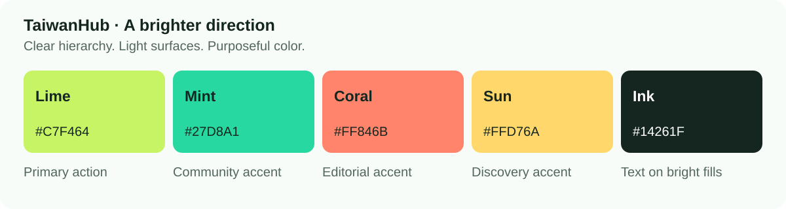

# TaiwanHub: a brighter, Robinhood-inspired UI/UX migration

Implementation guide · September 21, 2026 · Baseline commit `7a7b0bd`

> **Updated product direction:** use the [map-first, layer-led experience guide](map-first-layer-experience-guide.md) for the next home, navigation, discovery, and layer workflows. This document remains the visual style reference; its earlier feed-first home and optional-map recommendations are superseded by that guide.

## 1. Design decision and scope

Give TaiwanHub the clarity of a focused consumer app: a compact opening screen, strong content hierarchy, generous spacing, clear selection states, and one obvious next action per task. Express its community character through a bright lime, mint, coral, and yellow palette, authentic photography, and English/Traditional Chinese content.

**Recommended direction: bright, calm, and useful.** Use white and very pale mint for most surfaces, dark green-black text, lime for the principal action, and small areas of secondary color. Keep restaurant and event photographs central to discovery.

This document is based on the repository's actual routes, styles, components, data types, and tests. It is a modification guide, not an applied redesign. The companion CSS is a reference file and is not imported by the application. No app server was running on port 3000 during the audit; findings describe source behavior rather than a newly completed browser audit.

Deliverables:

- This migration plan, including screen specifications and implementation acceptance criteria.
- [Bright theme reference CSS](design/taiwanhub-bright-reference.css).
- [Palette reference](design/taiwanhub-bright-palette.svg).

The earlier Robinhood study is the visual inspiration. The specifications below are original recommendations for TaiwanHub, not Robinhood's internal design system. Here, “mobile” means the responsive web app; this repository does not contain a native mobile application.

## 2. Translate the inspiration into this product

| Robinhood pattern               | TaiwanHub adaptation                                               | Product reason                                                  |
| ------------------------------- | ------------------------------------------------------------------ | --------------------------------------------------------------- |
| Clear asset/value hierarchy     | Place name, recommendation score with response count, neighborhood | Help people decide where to eat                                 |
| Focused investing overview      | City, search, food recommendations, weekend plans                  | Make the home screen immediately useful                         |
| Compact time-range controls     | Today / This weekend / This week event controls                    | Reuse supported date filters                                    |
| Watchlists                      | Saved places, events, and finds                                    | Support a user's next outing                                    |
| Desktop content and action rail | Detail content plus directions, event facts, or RSVP rail          | Keep context beside the decision                                |
| Advanced desktop workspace      | Optional side-by-side place list and map                           | Support comparison without introducing a configurable dashboard |
| Progressive disclosure          | Secondary filters and optional contribution fields                 | Reduce initial form complexity                                  |
| Deliberate action feedback      | Saved, following, RSVP, and moderation states                      | Make community actions understandable                           |

Do not add stock charts, balance cards, trading language, fabricated trends, or a draggable widget system. A recommendation percentage is a community response ratio, not a market performance signal. Keep it neutral or consistently green; do not turn low scores into red “losses.”

## 3. Repository audit: retain, change, and fix

### Retain the existing foundation

- Next.js App Router pages and server-side catalog queries.
- Shared `ContentCard`, `CardGrid`, `TaiwaneseScore`, and `SectionHeading` entry points in `apps/web/src/components/cards.tsx`.
- English and Traditional Chinese dictionaries in `apps/web/src/lib/i18n.ts`.
- The five mobile destinations: Home, Explore, Events, Saved, Profile.
- Better Auth, shared Zod validation, API routes, community transactions, and authoritative refresh after mutations.
- Feature flags for products, organizations, and submissions.
- `Photo`'s distinction between optimized curated images and user-supplied image URLs.
- Clear demo labeling, source attribution, moderated notes, and the product-sighting inventory disclaimer.

### Verified source findings

| Current implementation                                                                                                  | Change to make                                                                          | Files                                          |
| ----------------------------------------------------------------------------------------------------------------------- | --------------------------------------------------------------------------------------- | ---------------------------------------------- |
| Six general color variables plus many literal colors                                                                    | Introduce semantic tokens, then migrate component-by-component                          | `globals.css`, `pages.css`, `responsive.css`   |
| Large split hero, fixed headline line breaks, script overlay, sticker, avatar decoration                                | Lead with city, a shorter heading, search, and useful content                           | `app/page.tsx`, hero selectors                 |
| At small widths, card kicker text drops to 7 px; score/count text to 8 px; mobile nav labels are 9 px                   | Use readable metadata and full-width mobile rows/cards                                  | `responsive.css`, `cards.tsx`                  |
| `.hero-search input` sets `outline: none`; input text reaches 11 px at one breakpoint                                   | Restore a focus indicator and use 16 px input text                                      | `globals.css`, `responsive.css`                |
| Navigation matches `/explore`, but detail/list routes include `/places`, `/products`, `/organizations`                  | Centralize route-family matching                                                        | `navigation.tsx`                               |
| City selector has no selected-city prop; options append `, TX`; English hero and several headers explicitly say Houston | Pass active city and render validated city metadata; preserve Houston-only launch scope | `layout.tsx`, `navigation.tsx`, relevant pages |
| Catalog map mode inserts a map above the same card grid                                                                 | Design a deliberate list/map layout                                                     | `app/[section]/page.tsx`, `map-view.tsx`       |
| Catalog GET filters omit hidden city/view values                                                                        | Preserve city and view on filter submission; reset page deliberately                    | `app/[section]/page.tsx`                       |
| Search constructs `listInput` from query text only                                                                      | Apply the same city resolution rule as catalog/home                                     | `app/search/page.tsx`                          |
| One `busy` flag disables all detail mutations                                                                           | Track the pending action and show an accurate label; keep mutation state synchronized   | `actions.tsx`                                  |
| Place recommendation UI always expands the note field                                                                   | Make the note optional to reveal; keep Yes/No immediately visible                       | `actions.tsx`                                  |
| Generic empty/loading states serve many contexts                                                                        | Add search, saved, catalog, and detail-specific states                                  | `cards.tsx`, `loading.tsx`, consuming pages    |
| Error/unavailable labels sometimes combine both languages in one string                                                 | Move these labels into the selected-locale dictionary                                   | `error.tsx`, `actions.tsx`, detail page        |
| Map pin color is a literal `#365c49`; popup uses English item name                                                      | Resolve a theme color and pass locale to localize popup content                         | `map-view.tsx`                                 |

The audit identifies redesign work, not permission to alter unrelated backend behavior. The current role checks, moderation rules, score calculation, capacity checks, and feature availability remain product constraints.

## 4. Brighter color system



### Core palette

| Token                  | Hex       | Intended use                                      |
| ---------------------- | --------- | ------------------------------------------------- |
| `--th-canvas`          | `#F7FCF8` | Main background; almost white with a hint of mint |
| `--th-surface`         | `#FFFFFF` | Content surfaces, menus, fields                   |
| `--th-surface-soft`    | `#EFF8F1` | Quiet selected/background groupings               |
| `--th-text`            | `#14261F` | Main text and labels on bright fills              |
| `--th-muted`           | `#53665C` | Supporting copy                                   |
| `--th-primary`         | `#C7F464` | Main CTA or a small selected emphasis             |
| `--th-primary-hover`   | `#B8E653` | Primary hover                                     |
| `--th-primary-pressed` | `#AAD744` | Primary press                                     |
| `--th-mint`            | `#27D8A1` | Small community illustrations/accents             |
| `--th-coral`           | `#FF846B` | Editorial/event accents                           |
| `--th-sun`             | `#FFD76A` | Discovery accents and date blocks                 |
| `--th-brand-text`      | `#006A51` | Links, active labels, recommendation text         |
| `--th-divider`         | `#DDE9E0` | Decorative section dividers                       |
| `--th-control-border`  | `#7B8F83` | Identifiable field/control boundary               |
| `--th-focus`           | `#2855D9` | Focus indication                                  |

### Semantic status colors

| Role    | Foreground | Background | Usage                               |
| ------- | ---------- | ---------- | ----------------------------------- |
| Success | `#116B40`  | `#E7F8ED`  | Saved or completed low-risk action  |
| Warning | `#805600`  | `#FFF5D6`  | Pending review or a caution         |
| Error   | `#B4233A`  | `#FFF0F2`  | Failed validation or failed request |

The large bright swatches are **fills with dark text**. They are not body-text colors on white. Pair normal prose with dark ink or muted text. Use the darker brand-text token for links instead of lime.

Calculated contrast ratios for solid color pairs:

| Pair                    | Ratio   |
| ----------------------- | ------- |
| Ink on lime             | 12.48:1 |
| Ink on mint             | 8.61:1  |
| Ink on coral            | 6.61:1  |
| Ink on yellow           | 11.44:1 |
| Muted on canvas         | 5.91:1  |
| Brand text on white     | 6.60:1  |
| Control border on white | 3.44:1  |

These calculations verify the named pairs only. Photos, alpha overlays, disabled controls, and composed surfaces require checks in the actual UI. Standard text should meet 4.5:1 and qualifying large text 3:1. [W3C contrast guidance](https://www.w3.org/WAI/WCAG22/Understanding/contrast-minimum.html)

### Color distribution

Aim for roughly 80% neutral surfaces, 15% photography or subtle tints, and 5% bright interface accents. This is a composition guideline, not a measurement requirement. Avoid a rainbow of equal-emphasis cards. Use coral/yellow inside selected editorial areas while keeping navigation and controls consistent.

**First release: light theme.** A brighter palette does not require a dark-mode project. Keep semantic names so a future dark theme can be introduced without rewriting components.

## 5. Typography, spacing, and shape

Use a system sans-serif stack with explicit Traditional Chinese fallbacks: `system-ui, -apple-system, BlinkMacSystemFont, "Segoe UI", "PingFang TC", "Microsoft JhengHei", sans-serif`. This avoids adding a font download as a redesign dependency. Inter can be evaluated later if desired.

| Role                         | Desktop  | Mobile   | Weight  |
| ---------------------------- | -------- | -------- | ------- |
| Home heading                 | 40/46 px | 30/38 px | 600     |
| Page/detail heading          | 36/44 px | 28/36 px | 600     |
| Section heading              | 24/32 px | 22/30 px | 600     |
| Card/row title               | 18/25 px | 17/24 px | 600     |
| Body and form input          | 16/24 px | 16/24 px | 400     |
| Buttons and field labels     | 14/20 px | 15/22 px | 500–600 |
| Metadata                     | 13/19 px | 13/19 px | 400     |
| Bottom nav label             | —        | 12/16 px | 500     |
| Detail recommendation number | 32/38 px | 28/34 px | 600     |

Use tight tracking only for large Latin headings. Apply normal letter spacing to Traditional Chinese text and let headings wrap naturally. Remove forced English line breaks from the application hero. Use tabular numbers for scores, counts, dates, and prices where alignment matters.

Spacing scale: **4, 8, 12, 16, 24, 32, 48, 64 px**. Use 16 px page padding at the smallest width, 20 px on most phones, and 32–48 px on desktop. Use 12–16 px within cards and 32–48 px between sections.

Shapes: 10 px input radius, 14 px card radius, 20 px sheet radius, and pill-shaped primary actions. Use quiet borders and minimal elevation. Keep images around 4:3 on feature cards; use 88–104 px thumbnails on compact mobile place rows. Do not give every text grouping a container.

Use 48 px input/control heights, 48–52 px primary actions, and at least 44 px intended touch areas. Small icons can stay 20–24 px inside those areas. This touch target recommendation exceeds the WCAG 2.2 AA baseline of 24 × 24 CSS px subject to its exceptions. [W3C target-size guidance](https://www.w3.org/WAI/WCAG22/Understanding/target-size-minimum.html)

## 6. Application shell and responsive rules

### Header

Reduce the desktop header from its current 91 px toward 72 px. Keep TaiwanHub's identity, city selector, language switch, and primary navigation. A plain white surface and a subtle bottom rule should carry the structure. Remove decorative tilt from the brand mark; a mint tile with dark text can preserve the 台 identity.

On mobile, use a compact brand row and a separate city/language row if needed. Do not solve width pressure with 10 px labels. Allow the city name to use the room it needs. Keep the city control optional to change; never require geolocation.

### Route ownership

| Navigation item | Active routes                                                                                        |
| --------------- | ---------------------------------------------------------------------------------------------------- |
| Home            | `/`                                                                                                  |
| Explore         | `/explore`, `/places`, `/places/*`, `/products`, `/products/*`, `/organizations`, `/organizations/*` |
| Events          | `/events`, `/events/*`                                                                               |
| Saved           | `/saved`                                                                                             |
| Profile         | `/profile`, `/profile/*`                                                                             |

Use one route-family helper for desktop and mobile. Match complete path segments, not arbitrary prefixes. Submission and admin routes do not need to falsely select a consumer destination. Use `aria-current="page"` for the active route link and a non-color visual cue.

### Breakpoints

| Width        | Target behavior                                                                  |
| ------------ | -------------------------------------------------------------------------------- |
| 320–599 px   | One content column; readable place rows; bottom navigation; compact filters      |
| 600–800 px   | Two feature-card columns when content fits; bottom navigation                    |
| 801–1099 px  | Desktop navigation if it fits; two or three columns; stack detail rail if needed |
| 1100–1439 px | Three feature-card columns; detail and optional map rail                         |
| 1440+ px     | Max content width around 1200–1280 px; avoid oversized card grids                |

Retain the existing 800 px navigation boundary initially, then test long Chinese labels. Consolidate the duplicated `max-width:600px` blocks in `responsive.css` as their rules migrate.

### Bottom navigation and action placement

Keep five labeled destinations. Use a subtle mint selection background and dark green label/icon, rather than color alone. Reserve bottom space with a shared navigation-height token plus `env(safe-area-inset-bottom)`.

Default detail actions to the normal document flow for the first release. If testing justifies a sticky RSVP or Directions control later, place it above the bottom navigation and reserve both heights in the content. Do not fix three independent layers—navigation, action bar, and demo notice—to the same bottom edge. The current demo banner is in document flow and should remain readable.

## 7. Home screen redesign

**Files:** `app/page.tsx`, `globals.css`, `responsive.css`, `i18n.ts`.

Recommended content order:

1. Compact city context and “Discover Houston through Taiwanese eyes.”
2. One short supporting sentence.
3. Full-width search with the existing accessible search name.
4. Two main intents: Find food and This weekend; supported secondary category shortcuts follow.
5. A short list of recommended places.
6. Upcoming weekend events.
7. Product sightings, when enabled, with reporting date and disclaimer.
8. Followed organization events when present.
9. One understated community contribution prompt, when submissions are enabled.

Replace the large decorative split hero with content that starts sooner. Preserve photography on the places and events users can actually open. An optional featured photograph can accompany the desktop heading; it should not push discovery below a long mobile introduction.

Remove the sticker, generic avatar stack, floating script text, and field-notes label from the main app landing experience. Those treatments can live in future editorial campaigns if needed. Keep the actual community language and images.

Reuse `getHomeFeed`, `featuredPlaces`, `upcomingEvents`, `recentProductSightings`, and `followedOrganizationEvents`. Do not derive fake total counts from the small home feed arrays. Do not add “near you” distance unless the product has a reliable location and distance source.

The home CTA currently points to `/submit/place` unconditionally. In the redesign, apply the same `flags.submissions` visibility rule used elsewhere. Resolve the selected city consistently before showing its name; remove literal city names only when the matching city data is available.

**Acceptance:** at 375 × 812 with normal text size, users can reach search and see the start of useful discovery content without scrolling past a large decorative image. At large text sizes, prioritize correct reflow over fitting an arbitrary fold.

## 8. Place cards, recommendation score, and discovery lists

**Files:** `cards.tsx`, `app/[section]/page.tsx`, shared styles.

Keep `ContentCard`'s existing props so shared consumers can migrate together. Add an optional presentation variant such as `feature` or `compact`; default it so existing call sites keep rendering.

**Feature card:** image → category/neighborhood → name → recommendation score and response count. Use it on desktop Home and selected editorial groups.

**Compact place row:** thumbnail on the left, name and neighborhood in the center, score/count underneath. Use it for narrow mobile lists, Search, and Saved. Do not compress a two-column mobile card into 7–8 px text.

`TaiwaneseScore` should support compact and detail presentations. Always preserve both `item.score` and `item.responses`. If `score === null`, show the existing no-votes message without a percentage or approval checkmark. Avoid implying that one positive vote is as established as hundreds; the count must remain adjacent.

Keep `recommendationScore` and `placeRank` unchanged. The displayed percentage and the ranking formula serve different purposes. Never replace the displayed raw score with a smoothed ranking value.

If quick-save is added later, make the save button a sibling of the destination link. The current card is wrapped in `.card-link`; nesting a button inside it would create conflicting interactive behavior. Quick-save needs actual per-item saved state; `Content` does not currently include it, so it is a separate enhancement rather than a free visual change.

Keep card images meaningful and demo labels visible. Preserve `.events-card` or intentionally update the E2E locators that rely on it. A hover lift is optional; a clear keyboard focus state is required.

## 9. Catalog filters and list/map behavior

**Files:** `app/[section]/page.tsx`, `map-view.tsx`, optional `catalog-filters.tsx`.

Use a visible search field, a readable filter summary, result count, sort control, and explicit List/Map switch. On mobile, put less-common filters in an expandable region; a native `<details>` is an adequate initial solution. Add a modal sheet only if its focus and dismissal behavior are implemented properly.

The server remains the source of truth. Keep filters in the URL so reload, sharing, and Back work. Supported query fields today are `city`, `q`, `category`, `neighborhood`, `organization`, `sort`, `period`, and `page`; `view` is a presentation query read separately from `listInput`.

### Query-state contract

- Resolve active city as explicit URL city, otherwise cookie city, otherwise Houston; validate it against supported cities.
- Preserve `city` and the current presentation `view` when submitting the GET filter form.
- Set `page=1` whenever search or filters change.
- Preserve filters when switching List/Map.
- “Clear filters” clears optional filters and query text, retains city and view, and returns to page 1.
- On route changes between content types, retain city and query only where meaningful; remove incompatible category/organization filters.
- Use the same resolution in unified Search. Search currently defaults to Houston through `listInput` when no city is passed.

### Map layout

First deliver an explicit map section with a clearly paired list. Then, if valuable, introduce a desktop split: approximately 55% list / 45% map. Mobile can switch between list-first and map-first modes while keeping the list available.

The current query returns 12 items per page, and `MapView` receives those items. Label the map as showing the current results page. A map of every result across Houston would need a separate bounded data contract; do not imply that the current map is complete.

Keep Mapbox dynamically loaded. Resolve the darker brand-text color for pins so they remain visible against the light map; use mint as a selected-pin accent with an outline. Pass locale to popup construction and use localized asset names. Preserve list usability when map loading fails.

Change the end-user fallback from mentioning a missing Mapbox token to a simple explanation such as “Map unavailable. You can still browse places and open directions.” Keep configuration diagnostics in developer-facing logs.

If implementing a synchronized selected row/pin later, create a small client boundary owning selected ID and the map/list interaction. Do not move the entire catalog repository or page into the client bundle.

## 10. Detail-page hierarchy and actions

**Files:** `app/[section]/[slug]/page.tsx`, `actions.tsx`, `pages.css`.

Move the entity name and key decision facts before the large image on mobile. The current 420 px desktop / 260 px mobile image precedes all main details; a shorter image or a header-first composition helps orientation.

| Kind         | First information                          | Main action                   | Supporting actions              |
| ------------ | ------------------------------------------ | ----------------------------- | ------------------------------- |
| Place        | Name, neighborhood, category, score/count  | Get directions when available | Save, recommend, website, share |
| Event        | Title, date/time with zone, venue, status  | RSVP                          | Save, share, organizer          |
| Product      | Name, brand, last reported locations/dates | I found this, when enabled    | Save, online link               |
| Organization | Name, identity, upcoming events            | Follow                        | Website, social links           |

Keep desktop detail content plus a 320–360 px action/facts rail. Use a sticky rail only if it fits the viewport and does not trap long content. On mobile, important event timing and venue belong above RSVP, not at the end of a long page.

### Preserve these states

- Save ↔ Saved; Follow ↔ Following; RSVP ↔ Cancel RSVP.
- Full or unavailable events still allow a user with an existing RSVP to cancel.
- Distinguish postponed, canceled, and ended events. The server remains authoritative about whether an RSVP is allowed.
- A guest action routes to sign-in with a safe return destination. The existing helper preserves pathname only; preserve relevant query context if the new flow depends on it.
- A binary recommendation can succeed while its accompanying text is pending moderation. Explain this distinction.
- A product report is “recently seen,” never a live stock guarantee.

Refactor `DetailActions` incrementally into a shared mutation controller and smaller visual groups. Do not render duplicate mobile/desktop form instances with the same `id="note"`, conflicting drafts, or independent pending states. Prefer one DOM instance that reflows.

Track the pending action so the button can say Saving…, Updating…, or Submitting…. Preserve input when a request fails; clear it only after success. Keep controls that could contradict an in-flight action disabled. After the API resolves, keep the UI synchronized until the refreshed authoritative state arrives so a stale button does not invite another action.

Separate action feedback from clipboard feedback. Sharing after a failed mutation should not inherit an old error style. Use a polite status message for success and an appropriate error announcement for failures.

## 11. Events, Saved, Search, Profile, and contribution forms

### Events

Use the existing `period=today|weekend|week` values for segmented links. The default unfiltered view should say Upcoming rather than labeling every event view This weekend. Use the date as the leading visual cue, with a sun-tinted date block and readable time/venue metadata. Keep organizer and attending count secondary but visible. Do not add countdown urgency for ordinary community events.

### Saved

Retain the authenticated route and existing `getSaved` result. Prefer compact rows grouped by kind. If introducing tabs, use actual loaded group counts and hide disabled product groups consistently. Give the empty page a direct path to Explore or Events. Quick removal is a later action enhancement with real saved state and confirmation feedback.

### Search

Keep English/Traditional Chinese matching and grouped results. Use the existing totals for group headers. Carry the selected city into queries and view-all links. Preserve the search term on failure. Review `autoFocus` on mobile so arriving from Home does not unnecessarily reopen the keyboard after results load.

### Profile and contributions

Use clear settings rows, a readable form, and one save action. Present contribution statuses with both text and semantic color. Make pending, approved, and rejected distinct; do not display pending content as publicly published. Keep role management outside the consumer profile.

### Sign-in and submissions

Retain React Hook Form and shared Zod schemas. Simplify the decorative auth aside, enlarge labels and inputs, and group submission fields into basics, location/time, and optional details. Start with one well-organized page; a stepper adds state and recovery complexity and is not required.

Use visible labels, inline help, and field-associated error text. On failed submission, preserve values and focus the first error. For event dates, keep the currently stated local time zone understandable. For uploads, show pending, failed, and complete states without resetting the whole form.

### Admin

Apply the same type, fields, status colors, and focus rules. Keep admin information dense enough for moderation. Do not redesign role checks, remove audit details, or introduce consumer promotional styling into moderation controls.

## 12. Component and CSS implementation structure

Keep shared UI with its existing consumer in `apps/web/src/components`; an empty `packages/ui` would add overhead. Continue using the current CSS approach rather than converting the entire app to a new component library.

Suggested structure as components earn reuse:

```text
apps/web/src/components/
  cards.tsx                   existing public entry point
  navigation.tsx              existing shell/navigation
  actions.tsx                 existing mutation boundary
  map-view.tsx                existing client map boundary
  ui/
    button.tsx                optional after variant rules stabilize
    field.tsx                 label/help/error association
    status-message.tsx        success/error announcement
    empty-state.tsx           contextual empty states
  catalog-filters.tsx         only if interactive disclosure needs it
  detail-summary.tsx          shared header/facts structure
```

Do not create all these components in advance. Extract once two screens share a stable pattern. Keep display-only components server-compatible; use client components for state, event handlers, or browser APIs. The installed Next.js docs in `node_modules/next/dist/docs/01-app/` confirm this boundary and the existing global CSS import approach.

### Styling migration rules

1. Keep `@import "tailwindcss"` in `globals.css`.
2. Introduce prefixed semantic tokens such as `--th-text`, `--th-primary`, and `--th-control-border`.
3. Replace the old root token definitions and migrate actual selectors. Updating six colors alone will miss many literal backgrounds and font overrides.
4. Keep the current layout import sequence (`globals.css`, `pages.css`, `responsive.css`) while auditing its overrides; later files can undo earlier changes.
5. Avoid a permanent fourth stylesheet of increasingly specific overrides. The reference CSS is a specification, not a mandate to append it after everything forever.
6. Use existing class names while migrating consumers, then remove obsolete selectors in the same phase that removes their markup.
7. Do not add `!important` to fight old responsive rules. Fix the owning rule.
8. Validate styles after a production build as well as dev navigation.

### Legacy token trap

`--coral` currently colors both text and filled backgrounds. Aliasing it directly to bright coral or lime could leave white button text with insufficient contrast or pale link text on white. The reference CSS temporarily maps both `--coral` and `--jade` to dark `--th-brand-text`, then gives migrated buttons explicit foreground/background pairs. This is a compatibility bridge, not the final token vocabulary.

Likewise, do not replace every `--line` with a dark control border. Decorative dividers should remain quiet; fields and controls receive their own stronger boundary token.

## 13. Interaction, accessibility, and bilingual behavior

Default motion: 120 ms for hover/press, 180 ms for local disclosure, and 240 ms for a sheet if one is introduced. Respect reduced motion. Avoid bouncing cards, continuous shimmer, and celebratory effects on ordinary Save or RSVP actions.

Every meaningful control requires default, hover where applicable, pressed/selected, keyboard focus, disabled, loading, and error behavior. Do not use `cursor: wait` for every disabled button; reserve busy styling for requests and explain permanent unavailability beside the control.

Move new labels into both dictionaries in `i18n.ts`, including navigation accessible names, skip link, event statuses, filter labels, pending verbs, empty-state copy, and map fallback. The current app mixes translated strings with hard-coded English and bilingual messages; migrate those alongside their components.

Suggested translations to review with a Traditional Chinese speaker:

| Key/purpose         | English                                       | Traditional Chinese                |
| ------------------- | --------------------------------------------- | ---------------------------------- |
| Filters             | Filters                                       | 篩選                               |
| Clear filters       | Clear filters                                 | 清除篩選                           |
| All upcoming events | Upcoming events                               | 即將舉行的活動                     |
| Saving              | Saving…                                       | 儲存中…                            |
| No saved items      | Save a place or event to find it here.        | 收藏店家或活動後，就能在這裡找到。 |
| Map unavailable     | Map unavailable. You can still browse places. | 地圖暫時無法使用，仍可瀏覽店家。   |
| Optional note       | Add a short note                              | 補充簡短心得                       |

Use one selected language for ordinary UI. English brand names may remain English. Preserve `html lang`, localized entity names, and fallback behavior. Do not translate database category values in URLs; map them to translated display labels while keeping the stored values stable.

Accessibility acceptance includes keyboard completion, visible focus, 200% text zoom, screen-reader labels/statuses, non-color state indicators, and reflow at 320 CSS px. Never hide meaningful content merely to pass a screenshot-width check.

## 14. File-by-file implementation map

Paths below are relative to the repository root.

| Priority | File                                                                              | Concrete modification                                                                                       |
| -------- | --------------------------------------------------------------------------------- | ----------------------------------------------------------------------------------------------------------- |
| P0       | `apps/web/src/app/globals.css`                                                    | Semantic tokens; typography; header; buttons; cards; focus; remove decorative hero rules as markup migrates |
| P0       | `apps/web/src/app/responsive.css`                                                 | Readable mobile sizes; compact rows; navigation safe area; consolidate overlapping media rules              |
| P0       | `apps/web/src/app/pages.css`                                                      | Filters, details, forms, statuses, empty states                                                             |
| P0       | `apps/web/src/components/navigation.tsx`                                          | Shared route matching; selected city; readable bilingual controls                                           |
| P0       | `apps/web/src/app/layout.tsx`                                                     | Pass locale/city context; localized shell labels; preserve CSS order                                        |
| P0       | `apps/web/src/lib/i18n.ts`                                                        | New labels and removal of touched hard-coded messages                                                       |
| P1       | `apps/web/src/app/page.tsx`                                                       | Compact discovery header; content-first order; submission flag                                              |
| P1       | `apps/web/src/components/cards.tsx`                                               | Feature/compact variants; readable score/count; contextual empty states                                     |
| P1       | `apps/web/src/app/[section]/page.tsx`                                             | Filter preservation; event heading; count; intentional map/list layout                                      |
| P1       | `apps/web/src/components/map-view.tsx`                                            | Token-based pin colors; localized popup; useful fallback                                                    |
| P1       | `apps/web/src/app/[section]/[slug]/page.tsx`                                      | Header-first mobile detail; early event facts; contextual primary action                                    |
| P1       | `apps/web/src/components/actions.tsx`                                             | Action-specific pending state; optional note; accurate feedback                                             |
| P2       | `apps/web/src/app/search/page.tsx`                                                | City-aware results and links; compact result presentation                                                   |
| P2       | `apps/web/src/app/saved/page.tsx`                                                 | Compact groups, flag parity, actionable empty states                                                        |
| P2       | `apps/web/src/components/submission-form.tsx`                                     | Readable grouped fields and retained values on errors                                                       |
| P2       | `apps/web/src/components/auth-form.tsx`                                           | Focused authentication layout and consistent controls                                                       |
| P2       | `apps/web/src/components/profile-form.tsx`                                        | Settings hierarchy and save feedback                                                                        |
| P2       | `apps/web/src/app/profile/contributions/page.tsx`                                 | Localized, readable moderation-status rows                                                                  |
| P2       | `apps/web/src/app/loading.tsx`, `error.tsx`, `not-found.tsx`                      | Context-appropriate feedback and localized recovery                                                         |
| P2       | `apps/web/src/app/admin/[[...section]]/page.tsx`, `components/admin-controls.tsx` | Adopt shared foundations; retain functional density                                                         |
| QA       | `tests/e2e/flows.spec.ts`, `moderation.spec.ts`, `playwright.config.ts`           | Extend meaningful flow coverage and responsive checks                                                       |

Database migrations and new API endpoints are not required for the core visual refresh. Map-wide results, card quick-save state, and richer city metadata may require separate data work if adopted.

## 15. Implementation phases and exit criteria

### Phase 0 — Baseline and route inventory

Capture Home, Places, Events, a place detail, an event detail, Search, Saved, sign-in, and submission screens in English and Chinese using a dedicated development/test database. Record enabled flags and fixture dates. Confirm a future event exists; old demo seeds can fall outside This weekend.

Exit: a reproducible baseline, route list, and known fixture state. Do not alter production data to make screenshots look populated.

### Phase 1 — Foundations and shell

Implement semantic colors, type scale, inputs/buttons, focus, route ownership, city display, and mobile navigation spacing. Keep page structure stable during this phase.

Exit: shell and controls work at 320, 375, 768, and 1440 px; both languages remain usable; selected route/city is accurate.

### Phase 2 — Home and shared discovery components

Simplify Home, migrate cards and scores, improve mobile rows, and preserve demo/feature-flag behavior.

Exit: Home exposes useful content sooner; no 7–9 px metadata remains in migrated consumer cards; scores/counts and imagery remain correct.

### Phase 3 — Catalog, Search, and map

Implement filter disclosure, query preservation, result counts, event period links, and the initial intentional map layout. Keep page-bound map scope explicit.

Exit: apply/clear/switch view/back/reload preserve the intended city and query; keyboard filtering works; map failure leaves discovery usable.

### Phase 4 — Details and community actions

Reorder detail content, introduce contextual main actions, improve pending/error behavior, and collapse optional recommendation notes.

Exit: guest return, save/unsave, yes/no changes, RSVP/cancel, full/canceled states, follow, and sharing all retain their behavior.

### Phase 5 — Supporting routes and cleanup

Apply the system to Saved, Profile, authentication, submissions, contributions, and admin foundations. Remove obsolete CSS, consolidate breakpoints, and update documentation/test expectations intentionally.

Exit: no mixed visual systems on common paths, no regressions in moderation, and production build validation complete.

Use one reviewable commit per phase. Ship each complete user journey together. If a phase regresses behavior, revert that phase instead of adding further override styles.

## 16. Validation plan

### Existing checks

Run from the repository root after implementation:

```sh
pnpm lint
pnpm typecheck
pnpm test
pnpm test:e2e
pnpm build
```

Run `pnpm test:integration` when mutation or query behavior changes. These browser/integration checks require the configured dedicated database and fixtures described in README. `playwright.config.ts` already starts the dev server when needed and uses `E2E_PORT` if supplied.

The current E2E flow checks the exact English/Chinese hero, search label, event card class, and key action labels. Update assertions when wording changes intentionally; keep the same behavioral checks. Retaining the existing headline and accessible search name reduces unnecessary test churn.

### Add meaningful regression coverage

| Scenario                                                      | Expected result                                                 |
| ------------------------------------------------------------- | --------------------------------------------------------------- |
| `/places/[slug]`, `/products/[slug]`, `/organizations/[slug]` | Explore highlighted in both navigation layouts                  |
| Filter form with city and map view                            | City/view retained; page resets on filter change                |
| Search from selected city                                     | Search and view-all links use the selected city                 |
| Browser Back after filter/detail navigation                   | Expected query and content restored                             |
| 320/375/768/1440 widths, both languages                       | No page-wide horizontal overflow; readable controls             |
| No votes                                                      | No fabricated percentage or misleading approval icon            |
| Full/unavailable event with existing RSVP                     | Cancellation remains possible                                   |
| Failed recommendation with note                               | Draft note remains; error is understandable                     |
| Slow save or RSVP                                             | No conflicting repeat action before authoritative state settles |
| Map token absent/load failure                                 | List and useful directions remain usable                        |
| Product/submission flags disabled                             | Related entry points consistently hidden                        |
| Product sighting submitted                                    | Pending moderation message, not an inventory promise            |

Use keyboard-only checks and screen-reader spot checks on navigation, filters, forms, and status messages. Automated screenshots alone do not verify accessibility.

### Visual acceptance

- At most one high-emphasis primary action in each task region.
- Dark text on lime/mint/coral/yellow fills; no pale text links on white.
- Consistent 13 px or larger metadata in migrated consumer views.
- Images retain deliberate aspect ratios and accurate demo labels.
- Place names and long Chinese labels wrap without hiding key information.
- Bottom navigation does not overlap final form controls, footer content, or demo notice.
- Loading states match the new layout and honor reduced motion.
- Page transitions and production styling do not flash between old and new systems.

### Performance and data acceptance

Keep catalog pages server-rendered, map code lazy, and image dimensions reserved. Update image `sizes` when changing card columns; the current values describe the old grid. Reuse `Photo` and avoid preloading every card image. Preserve metadata, canonical URLs, demo `noindex`, and source labels. Do not add client state libraries or chart dependencies solely for visual resemblance.

## 17. Completion checklist

- [ ] Semantic token migration completed across global/page/responsive CSS.
- [ ] Home reduced to a clear city/search/discovery sequence.
- [ ] Shared place/event components readable at phone widths.
- [ ] Explore route ownership and active city fixed.
- [ ] Filter/search city and URL state consistent.
- [ ] Map scope and fallback clearly communicated.
- [ ] Detail facts precede their relevant actions on mobile.
- [ ] Save, vote, RSVP, follow, and moderation states preserved.
- [ ] Both dictionaries updated for touched screens.
- [ ] Demo labels, feature flags, and product-sighting language preserved.
- [ ] Focus, contrast, touch areas, zoom, and reduced motion reviewed.
- [ ] Relevant automated checks and visual reviews passed.
- [ ] Obsolete decorative selectors and conflicting overrides removed.

## 18. Implementation handoff prompt

> Implement the TaiwanHub bright UI/UX migration described in `docs/ui-ux-modernization-guide.md`, starting with Phases 0–2. Read applicable AGENTS.md and the installed Next.js docs before changing application code. Use `docs/design/taiwanhub-bright-reference.css` as the token/component specification, integrating rules into their existing owners rather than layering permanent overrides. Preserve server components, the catalog/service architecture, English/Traditional Chinese support, feature flags, demo labeling, score semantics, authentication, and community actions. Fix navigation route ownership and city display as part of the shell. Keep native/mobile-app work, new dashboards, new scoring systems, and new backend dependencies outside scope. Validate the affected flows, responsive behavior, and build, and report remaining phases explicitly.

## 19. Evidence and reference notes

Repository sources inspected: root package manifest and README; `docs/product.md` and `docs/architecture.md`; the shell and three stylesheets; Home, catalog, detail, Search, Saved, contribution routes; cards, navigation, actions, map, image, and form components; configuration, localization, shared query schema, catalog data types; and existing browser tests.

Framework guidance consulted locally: installed Next.js `01-getting-started/11-css.md` and `05-server-and-client-components.md`. Use that version-matched documentation again during implementation, as required by `apps/web/AGENTS.md`.

External design references: [Robinhood identity direction](https://robinhood.com/us/en/newsroom/a-new-visual-identity/), [published chart/mobile interface](https://robinhood.com/us/en/support/articles/using-charts/), and [Legend layouts](https://robinhood.com/us/en/support/articles/layouts-on-legend/), reviewed in the preceding design study. Accessibility references are linked beside their recommendations above.

Validation performed for this guide: source inspection, solid-color contrast calculations, and documentation/reference consistency checks. The proposed application changes and the full regression suite have not been executed in this guide-only task.
